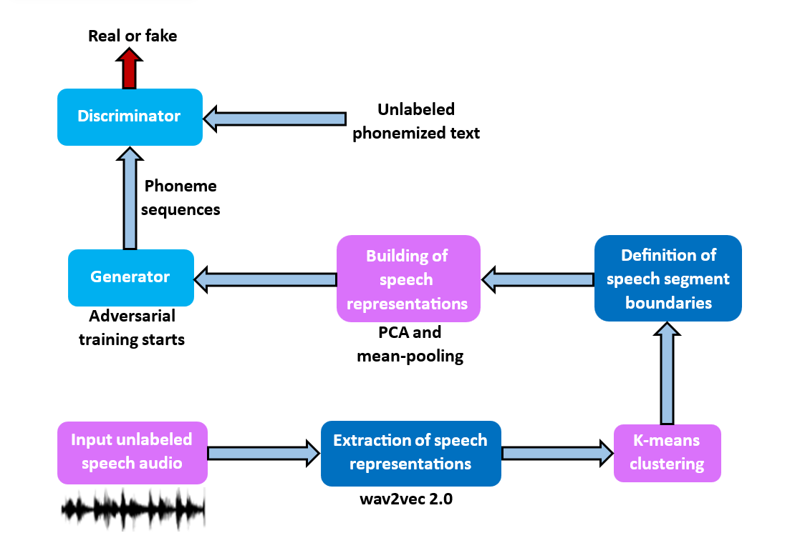
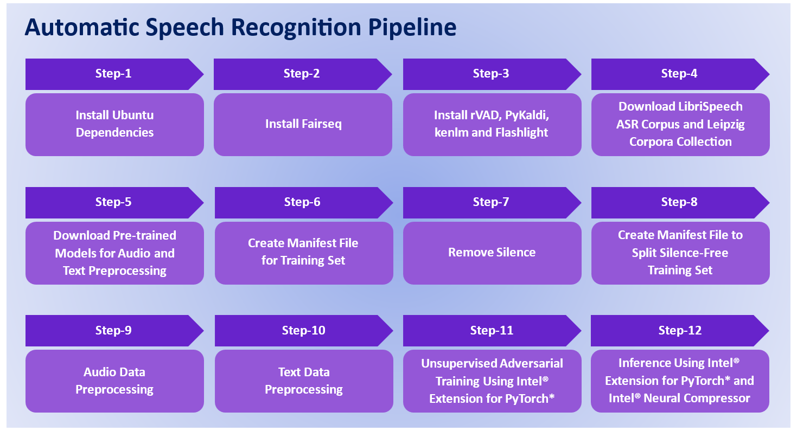

# AI Transcription

## Introduction

Build an optimized Automatic Speech Recognition (ASR) solution that converts unlabeled speech audio signals into phonemized text using Intel® Extension for PyTorch\* and Intel® Neural Compressor, following an unsupervised adversarial training approach. Check out the [Developer Catalog](https://developer.intel.com/aireferenceimplementations) for information about different use cases.

## Solution Technical Overview

Behavioral health-related issues require multiple therapy sessions, detailed Psychotherapy notes during the session, and subsequent analysis. In-depth analysis can often provide a root cause of symptoms such as low mood, lack of positive emotion, and other emotional and cognitive disorders attributable to substance abuse or personality disorders. Accurate analysis and prediction of conditions and symptoms can result in medication that can drive better outcomes for the patient. Regulations also require psychologists to create progress notes based on the therapy sessions that can assist in multiple tasks, including [[1]](#lcsw_2021):

■ Helping therapist to keep track of each client and their treatment
<br>■ Coordinating care by communicating pertinent information to other members of the care team
<br>■ Maintaining a paper trail for agency audits and quality assurance
<br>■ Complying with professional obligations
<br>■ Billing for services

However, taking Psychotherapy notes, subsequent analysis, and writing detailed progress notes can consume up to half the time. With a growing rate of mental issues and a shortage of psychiatrists, appointments for therapy can be difficult, resulting in situations where patients that need care decline the service altogether.

Our analysis of the market demand led us to two fundamental questions:
1. How can Artificial Intelligence (AI) models drive higher productivity for psychologists?
2. How can these solutions be deployed at scale, reducing the time to implement the solution and the cost per outcome? 

The problem of manually writing exhaustive documentation during and after Psychotherapy sessions that negatively impacts therapist productivity can be addressed by automated speech processing techniques equipped with AI algorithms. In particular, Automatic Speech Recognition (ASR) applications emerge as a suitable alternative solution.

An ASR system allows a computer to take as an input an audio file or a speech from the microphone and convert it into a text [[2]](#malik_2020). ASR is a core technology to enable human-machine interactions and it has had great commercial success in the development of applications for areas like information access and speech-to-speech translation [[3]](#lu_2019). 

Recently, the performance of ASR systems has greatly benefited from the incorporation of deep learning techniques like Recurrent Neural Networks and Transformers [[4]](#mehrish_2023), which in turn require a huge volume of transcribed speech data to increase recognition accuracy. However, labeling large datasets is not just a time-consuming activity, but also involves a high monetary cost. 

This reference kit provides an ASR solution that carries out the transcription of audio into text using a Generative Adversarial Network (GAN) trained following an unsupervised approach with unlabeled audio data. Moreover, considering the scale demands for an ASR system in the context of Psychotherapy sessions, the ASR system proposed in this reference kit allows an efficient deployment while maintaining the accuracy and speeding up the inference time by leveraging the following Intel® optimization packages:


* ***Intel® Distribution for Python\****

  The [Intel® Distribution for Python\*](https://www.intel.com/content/www/us/en/developer/tools/oneapi/distribution-for-python.html) provides:

    * Scalable performance using all available CPU cores on laptops, desktops, and powerful servers
    * Support for the latest CPU instructions
    * Near-native performance through acceleration of core numerical and machine learning packages with libraries like the Intel® oneAPI Math Kernel Library (oneMKL) and Intel® oneAPI Data Analytics Library
    * Productivity tools for compiling Python\* code into optimized instructions
    * Essential Python\* bindings for easing integration of Intel® native tools with your Python\* project

* ***Intel® Extension for PyTorch\****

  With a few lines of code, you can use [Intel® Extension for PyTorch\*](https://www.intel.com/content/www/us/en/developer/tools/oneapi/optimization-for-pytorch.html#gs.5vjhbw) to:
    * Take advantage of the most up-to-date Intel software and hardware optimizations for PyTorch\*.
    * Automatically mix different precision data types to reduce the model size and computational workload for inference.
    * Add your own performance customizations using APIs.

* ***Intel® Neural Compressor***

  [Intel® Neural Compressor](https://www.intel.com/content/www/us/en/developer/tools/oneapi/neural-compressor.html#gs.5vjr1p) performs model compression to reduce the model size and increase the speed of deep learning inference for deployment on CPUs or GPUs. This open source Python\* library automates popular model compression technologies, such as quantization, pruning, and knowledge distillation across multiple deep learning frameworks.

The ASR system introduced in this project can be used as a foundation to automate the generation of progress reports for Psychotherapy sessions. A further enhancement is possible when paired with other predictive methodologies to analyze the results to provide the right course of action for the patient.

In the [Solution Technical Details](#solution-technical-details) section, the interested reader can find a more thorough technical discussion regarding the ASR solution presented in this reference kit, while the components of the ASR system workflow are described in the [How it Works section](#how-it-works), along with an explanation on how Intel® Extension for PyTorch\* and Intel® Neural Compressor are useful in boosting the training and inference performance of the system.

For more details, visit [Intel® Distribution for Python](https://www.intel.com/content/www/us/en/developer/tools/oneapi/distribution-for-python.html), [Intel® Extension for PyTorch\*](https://www.intel.com/content/www/us/en/developer/tools/oneapi/optimization-for-pytorch.html#gs.5vjhbw), [Intel® Neural Compressor](https://www.intel.com/content/www/us/en/developer/tools/oneapi/neural-compressor.html#gs.5vjr1p), and the [AI Transcription](https://github.com/oneapi-src/ai-transcribe) GitHub repository.

## Solution Technical Details

In this section, the interested reader can find a more in deep explanation regarding the speech-to-text mapping process implemented by the proposed ASR solution. A description of the datasets used by the ASR pipeline is also presented. 

### Speech to Text Conversion Using the Wav2vec-U Framework

Human language encompasses various facets of expression, including spoken communication, written text and sign language [[4]](#mehrish_2023). For speech, the concept of phonemes is essential as they can be seen as descriptors that represent the different sounds which distinguish words from each other, e.g., the word cat entails three phonemes /K/, /AE/ and /T/, which correspond to the three distinct sounds that makes up the pronunciation of the word [[5]](#baevsky_2021). As will be seen later in the implementation of this reference kit ASR system, the use of phonemes becomes very important to achieve high accuracy in the speech-to-text task. 

The present reference kit provides a solution that carries out the process of converting speech to text by leveraging a toolkit called Fairseq (Facebook\* AI Research Sequence-to-Sequence Toolkit) developed by Meta\*. Fairseq allows to train custom models to address multiple sequence-to-sequence problems, including translation and summarization. Please refer to the [Fairseq](https://github.com/facebookresearch/fairseq) repository to learn all the details behind this toolkit. 

To be more specific, with the aim of achieving the speech transcription task, this reference kit utilizes a specialized Fairseq framework called Wav2vec-U, which performs training speech recognition in an unsupervised manner, given no labeled training data at all. Wav2vec-U is part of the ASR systems that work in a two-step pipeline: a preprocessing stage followed by the unsupervised training stage, with the goal of mapping input audio speech signals into phoneme sequences [[6]](#liu_2023). Next, the stages of the Wav2vec-U framework are outlined according to the research paper [[5]](#baevsky_2021) where this methodology is proposed.
  
  1) Speech signal representations are extracted by the wav2vec 2.0 model [[7]](#baevsky_2020) using self-supervised learning. The wav2vec 2.0 model implements a convolutional feature encoder to maps raw audio sequences to latent speech representations, which a Transformer converts into context representations.
  2) K-means clustering is applied to the speech representations with the aim to grouping similar phonetic characteristics.
  3) The clusters are leveraged to introduce speech segment boundaries whenever the cluster identifier changes.
  4) Segmented representations are build using Principal Component Analysis (PCA) for dimensionality reduction and a mean-pooled process that also includes adjacent segments.
  5) From this stage, the training process starts by using a GAN, inputting the segmented representations to the generator, whose outcomes are phoneme sequences. These phonemes correspond to the transcriptions of the initial input audio signals.
  6) The discriminator is fed with unlabeled phonemized text, as well as with the phoneme sequences produced by the generator.
  7) The discriminator is trained to determine whether the phonemes come from the generator (fake) or from the unlabeled text data (real).   

**Note:** It is especially important to consider that the transcriptions produced by the GAN are presented as phonemes. The reason behind this is that it was found easier to learn a mapping between speech audio and phonemes rather than between speech audio and letters or words [[5]](#baevsky_2021). 

The next workflow diagram offers a visual illustration of the Wav2vec-U pipeline previously described.



### Datasets

As the ASR system presented in this reference kit relies on an unsupervised adversarial training procedure where the Generator requires input audio in the form of phoneme sequences whereas the Discriminator receives phonemized text as input (please refer to [Speech to Text Conversion Using the Wav2vec-U Framework](#speech-audio-dataset) subsection for more information), it becomes necessary to obtain a dataset of audio samples for the Generator and a text corpora for the Discriminator.

#### Speech Audio Dataset
The audio dataset used in this reference kit is the LibriSpeech ASR corpus from [Open SLR](https://www.openslr.org/12/). The data is fetched from Open SLR using a shell script (see this [subsection](#librispeech-asr-corpus)). The shell script is adapted from this [source](https://github.com/opendcd/opendcd/blob/master/egs/librispeech-get-data.sh).

LibriSpeech ASR corpus is an audio speech corpus of approximately 1,000 hours of read English speech from the LibriVox project of public-domain audiobooks. Each sample in the dataset consists of voice samples read from audiobooks and used as a substitute to recreate patients' recorded voices during therapy sessions.

| **Use case** | Speech-to-text conversion
| :--- | :---
| **Name** | LibriSpecch ASR corpus <br>
| **Size** | Total 5,323 voice samples
| **Development Set** | 2,703 voice samples
| **Test Set** | 2,620 voice samples
| **Data format** | .flac & .wav


It is important to state that even though the LibriSpeech ASR corpus is splitted into several parts, for the specific case of this reference kit, only two subsets of the corpus are used: the *dev-clean* and the *test-clean* subsets.

> *Please see this data set's applicable license for terms and conditions. Intel® does not own the rights to this data set and does not confer any rights to it.*

#### Text Corpora Dataset
The English version of the Leipzig Corpora Collection [[8]](#goldhahn_2012) is used in this reference kit to feed the Discriminator with unlabeled text sentences. 

The Leipzig Corpora Collection provides a corpora in different languages, including English, German and French, all using the same format and comparable resources. For each language, the corpora is collected by randomly selected sentences and is available in sizes from 10,000 sentences up to 1 million sentences. The collection sources are either newspaper texts or texts randomly collected from the web. For more information about the Leipzig Corpora Collection, see the [download page](https://wortschatz.uni-leipzig.de/en/download).

The next table shows more details about the English corpora from the Leipzig Corpora Collection used in this reference kit:

| **Use case** | Speech-to-text conversion
| :--- | :---
| **Name** | Leipzig Corpora Collection <br>
| **Language** | English
| **Year** | 2005
| **Size** | 10,000 text sentences

> *Please see this data set's applicable license for terms and conditions. Intel® does not own the rights to this data set and does not confer any rights to it.*

## Validated Hardware Details
There are workflow-specific hardware and software setup requirements depending on how the workflow is run. 

| Recommended Hardware                                            | Precision
| ----------------------------------------------------------------|-
| CPU: Intel® 2nd Gen Xeon® Platinum 8280L CPU @ 2.70GHz or higher | FP32, INT8
| RAM: 187 GB                                                     |
| Recommended Free Disk Space: 20 GB or more                      |

Code was tested on Ubuntu\* 22.04 LTS.

## How it Works
The implementation of the ASR solution presented in this reference kit consists mainly in the deployment of the Wav2vec-U framework, which essentially involves the preprocessing of the input speech data and the unsupervised adversarial training (see this [subsection](#speech-to-text-conversion-using-the-wav2vec-u-framework) for more details). However, before executing the Wav2vec-U pipeline, it is required to meet some pre-requisites. The instructions to install these pre-requisites and deploy the Wav2vec-U pipeline are explained as follows:

  1) Install Ubuntu Dependencies. In order to properly install Fairseq, PyKaldi, kenlm and Flashlight in further steps and also enabling other processing tasks, it is mandatory to install certain Ubuntu dependencies. The E-Speak tool is also installed in this step.

  2) Install Fairseq. This step requires to clone the Fairseq repository and make certain setups to use a specific version of the repository that enables the use of Intel® Extension for PyTorch\* and Intel® Neural Compressor.

  3) Install rVAD, PyKaldi, kenlm and Flashlight. In this step, the next set of tools is installed: E-Speak, rVAD, PyKaldi, kenlm and Flashlight. These packages are required to accomplish the preprocessing of audio and text data, the unsupervised adversarial training, and the inference with the trained GAN model.

  4) Download LibriSpeech ASR Corpus and Leipzig Corpora Collection. The speech audio data and the text corpus are downloaded in this stage. For more information about these datasets, see this [subsection](#datasets).

  5) Download Pre-trained Models for Audio and Text Preprocessing. In order to obtain useful audio representations, a simpler version of the wav2vec 2.0 model is downloaded. In the case of the text data, it is preprocessed using a pre-trained fasttext LID model called *lid.176.bin* [[9]](#joulinb_2016)[[10]](#joulinf_2016).

  6) Create Manifest File for Training Set. In this stage, the audio training set is defined in a *tsv* file using the LibriSpeech dataset downloaded in step 4. 

  7) Remove Silence. Using the rVAD library installed in step 3, a voice activity detection takes place with the aim to remove unwanted silence sections present in the audio training set.

  8) Create Manifest File to Split Silence-Free Training Set. Now that the audio training set is defined and the silence sections have been removed, this training set is split to create a validation set.

  9) Audio Data Preprocessing. A feature engineering process is conducted on the training and validation set generated in step 8, producing segmented representations. Here is precisely where the Wav2vec-U pipeline starts its execution as explained in the [Speech to Text Conversion Using the Wav2vec-U Framework](#speech-to-text-conversion-using-the-wav2vec-u-framework) subsection.

  10) Text Data Preprocessing. The text corpus downloaded in step 4 is converted into phonemized text.

  11) Unsupervised Adversarial Training Using Intel® Extension for PyTorch\*. In this stage, the Generator is fed with audio segmented representations, and during training, it learns to map these sequences into phonemes. Then, the Discriminator takes as input either the sequence of phonemes produced by the Generator or the sequence of phonemized text and is trained to indicate how likely the input sequence of phones is to be from the text data or from the audio signals. Intel® Extension for PyTorch\* is applied in this stage to boost the training performance.

  12) Inference Using Intel® Extension for PyTorch\* and Intel® Neural Compressor. Based on the model trained in step 11, input audio data is converted into phonemized text. Along with Intel® Extension for PyTorch\*, the inference is accelerated by the application of Intel® Neural Compressor.

As a useful visual reference, these steps are illustrated in the following diagram.



### Training/Inference Using Intel® Optimization Packages
Training a GAN model, and making inference with it, usually represent compute-intensive tasks. To address these requirements and to gain a performance boost on Intel hardware, in this reference kit the adversarial training includes the implementation of Intel® Extension for PyTorch\*, whereas the inference stage also incorporates the use of Intel® Neural Compressor. 

For the training process, the machine learning practitioner can easily set the number of epochs as stated [here](#hyperparameter-tuning). This accessible approach, and the performance gains provided by Intel® Extension for PyTorch\*, enable rapidly frequent re-training to analyze the performance of multiple GAN models for transcribing audio signals into phonemized text. Another important aspect of the GAN models trained with Intel® Extension for PyTorch\* is that these models are trained using a FP32 precision.

The inference phase is refined using the optimization features of Intel® Neural Compressor, along with Intel Extension for PyTorch\*. Intel® Neural Compressor functionalities are applied to compress the trained FP32 GAN model via a post-training quantization procedure, converting the FP32 model into an INT8 model, which improves the performance of the model in inference time without compromising its accuracy and supports an efficient deployment of the quantized model in a wide range of Intel® CPUs and GPUs. 

## Get Started
Start by **defining an environment variable** that will store the workspace path, this can be an existing directory or one to be created in further steps. This ENVVAR will be used for all the commands executed using absolute paths.

[//]: # (capture: baremetal)
```bash
export WORKSPACE=$PWD/ai-transcribe-for-behavioral-health
```

Also, it is necessary to define the following environment variables that will be used in later stages.

[//]: # (capture: baremetal)
```bash
export OUTPUT_DIR=$WORKSPACE/output 
export SRC_DIR=$WORKSPACE/src
export DATA_DIR=$WORKSPACE/data
export FAIRSEQ_ROOT=$SRC_DIR/fairseq
export CORPUS_DATA=$FAIRSEQ_ROOT/corpusdata
export RVAD_ROOT=$SRC_DIR/rVADfast
export KENLM_BUILD=$SRC_DIR/kenlm/build
export KENLM_ROOT=$KENLM_BUILD/bin
export KALDI_TOOLS=$SRC_DIR/pykaldi/tools
export KALDI_ROOT=$KALDI_TOOLS/kaldi
export LD_LIBRARY_PATH="/lib:$KALDI_ROOT/tools/openfst-1.6.7/lib:$KALDI_ROOT/src/lib"
export VCPKG=$SRC_DIR/vcpkg
export PYTHONPATH=$PYTHONPATH:$FAIRSEQ_ROOT/examples
```

### Download the Workflow Repository
Create the workspace directory for the workflow and clone the [AI Transcribe for Behavioral Health](https://github.com/oneapi-src/ai-transcribe) repository inside it.

```bash
mkdir -p $WORKSPACE && cd $WORKSPACE
```

```bash
git clone https://github.com/oneapi-src/ai-transcribe $WORKSPACE
```

### Set Up Conda
Please follow the instructions below to download and install Miniconda.

1. Download the required Miniconda installer for Linux.
   
   ```bash
   wget https://repo.anaconda.com/miniconda/Miniconda3-latest-Linux-x86_64.sh
   ```

2. Install Miniconda.
   
   ```bash
   bash Miniconda3-latest-Linux-x86_64.sh
   ```

3. Delete Miniconda installer.
   
   ```bash
   rm Miniconda3-latest-Linux-x86_64.sh
   ```

Please visit [Conda Installation on Linux](https://docs.anaconda.com/free/anaconda/install/linux/) for more details. 

### Set Up Environment
Execute the next commands to install and setup libmamba as conda's default solver.

```bash
conda install -n base conda-libmamba-solver
conda config --set solver libmamba
```

| Packages | Version | 
| -------- | ------- |
| intelpython3_core | 2024.0.0 |
| python | 3.10.13 |
| libblas | 3.9.0 |
| libcblas | 3.9.0 |
| libfaiss | 1.7.4 |
| libfaiss-avx2 | 1.7.4 |
| sqlite | 3.41.1 |
| gperftools | 2.10 |
| pip | 23.3.1 |
| torch | 2.0.1 |
| torchaudio | 2.0.2 |
| torchvision | 0.15.2 |
| intel-extension-for-pytorch | 2.0.100 |
| neural-compressor | 2.3.1 |
| numpy | 1.23.1 |
| pyparsing | 3.1.1 |
| ninja | 1.11.1.1 |
| npy-append-array | 0.9.16 |
| psutil | 5.9.6 |
| scikit-learn | 1.3.2 |
| Oauthlib | 3.2.2 |
| soundfile | 0.12.1 |
| phonemizer | 3.2.1 |
| faiss-cpu | 1.7.4 |
| editdistance | 0.6.2 |
| fasttext-wheel | 0.9.2 |
| tensorboardX | 2.6.2.2|

The dependencies required to properly execute this workflow can be found in the yml file [$WORKSPACE/env/intel_env.yml](env/intel_env.yml).

Proceed to create the conda environment.

```bash
conda env create -f $WORKSPACE/env/intel_env.yml
```

Environment setup is required only once. This step does not cleanup the existing environment with the same name hence we need to make sure there is no conda environment with the same name. During this setup, `ai_transcription_intel` conda environment will be created with the dependencies listed in the YAML configuration.

Activate the `ai_transcription_intel` conda environment as follows:

```bash
conda activate ai_transcription_intel
```

### Automatic Speech Recognition Pipeline

Next, the different stages of the speech-to-text solution are executed. The [How it Works](#how-it-works) section provides a description for each of the steps.

**Note:** Please be aware that the runtime of the pipeline may take up to 5 hours.

### Install Ubuntu Dependencies

The following Ubuntu dependencies are required to successfully configure and install multiple libraries/packages in further steps.

#### Fairseq Pre-requisites:

```bash
apt install g++ -y
apt-get install libgl1 -y
```

#### E-Speak Installation:

The next dependency is enough to successfully install E-Speak: 

```bash
apt-get install espeak -y
```

#### PyKaldi Pre-requisites:

```bash
apt-get install autoconf automake cmake curl g++ -y
apt-get install git graphviz libatlas3-base libtool make -y
apt-get install pkg-config subversion unzip wget zlib1g-dev -y
apt-get install sox gfortran python2.7 -y 
```

#### kenlm Pre-requisites:

```bash
apt-get install libboost-all-dev libeigen3-dev liblzma-dev -y
apt-get install zlib1g-dev libbz2-dev bzip2 -y
```

#### Flashlight Pre-requisites:

```bash
apt-get install curl zip unzip tar -y
```

#### Pre-requisite for Audio Data Preparation:

```bash
apt install zsh -y
```

#### Pre-requisite for Inference Stage:

```bash
apt install numactl -y
```

### Install Fairseq

[//]: # (capture: baremetal)
```bash
cd $SRC_DIR
git clone https://github.com/facebookresearch/fairseq
cd $FAIRSEQ_ROOT
git reset --hard 97b2d8153babe06d3580add6eb512c7e2fbc0fc6
git apply --reject --whitespace=fix  ../fairseq_patch.patch
pip install --editable ./
```

### Install rVAD, PyKaldi, kenlm and Flashlight

In this step, the next set of tools is installed: rVAD, PyKaldi, kenlm and Flashlight.

#### Install rVAD

[//]: # (capture: baremetal)
```bash
cd $SRC_DIR
git clone https://github.com/zhenghuatan/rVADfast.git
```

#### Install PyKaldi

PyKaldi will be installed from the source.

**a) First, clone PyKaldi repository.**

[//]: # (capture: baremetal)
```bash
cd $SRC_DIR
git clone https://github.com/pykaldi/pykaldi.git
```

**b) Running the commands below will install the Python packages needed for building PyKaldi from the source.**

[//]: # (capture: baremetal)
```bash
cd $KALDI_TOOLS
./check_dependencies.sh
./install_protobuf.sh
./install_clif.sh
chmod 775 install_mkl.sh
./install_mkl.sh 
./install_kaldi.sh 
```

#### Install kenlm

kenlm will be built from source.

[//]: # (capture: baremetal)
```bash
cd $SRC_DIR
wget -O - https://kheafield.com/code/kenlm.tar.gz |tar xz
mkdir $KENLM_BUILD
cd $KENLM_BUILD
cmake ..
make -j2
```

#### Install Flashlight

Flashlight will be built from source, which requires the installation of the MKL and VCPKG packages.

**a) Install VCPKG.**

[//]: # (capture: baremetal)
```bash
cd $SRC_DIR
git clone https://github.com/microsoft/vcpkg
./vcpkg/bootstrap-vcpkg.sh
cd $VCPKG
./vcpkg install intel-mkl fftw3 kenlm arrayfire[cpu] gloo[mpi] openmpi onednn cereal stb gflags glog libsndfile gtest 
```

**b) Install Flashlight Sequence.**

[//]: # (capture: baremetal)
```bash
cd $FAIRSEQ_ROOT
git clone https://github.com/flashlight/sequence && cd sequence
pip install .
```

### Download LibriSpeech and Leipzig Corpora Collection 

#### LibriSpeech ASR Corpus

Proceed to download LibriSpeech ASR Corpus.

[//]: # (capture: baremetal)
```bash
cd $DATA_DIR
sh data.sh 
```

Navigate inside the LibriSpeech folder:

```bash
cd LibriSpeech
```

It should have the below folder structure:

```bash
LibriSpeech
  |--- dev-clean
  |--- test-clean
```

#### Leipzig Corpora Collection 

Execute the below commands to download and extract the English text corpus from the Leipzig Corpora Collection. 

[//]: # (capture: baremetal)
```bash
cd $FAIRSEQ_ROOT
mkdir $CORPUS_DATA
cd $CORPUS_DATA
wget https://downloads.wortschatz-leipzig.de/corpora/eng_news_2005_10K.tar.gz
tar -xvf eng_news_2005_10K.tar.gz
```

### Download Pre-trained Models for Audio and Text Preprocessing 

[//]: # (capture: baremetal)
```bash
cd $FAIRSEQ_ROOT
wget https://dl.fbaipublicfiles.com/fasttext/supervised-models/lid.176.bin
wget https://dl.fbaipublicfiles.com/fairseq/wav2vec/wav2vec_small.pt
```

### Create Manifest File for Training Set

In this step, training data preprocessing begins. The training process will be conducted based on the *development set* from the LibriSpeech ASR corpus. This [subsection](#speech-audio-dataset) offers more details about such dataset.

Run the following command to preprocess the audio data and generate a `tsv` file containing the audio training dataset.

[//]: # (capture: baremetal)
```bash
cd $FAIRSEQ_ROOT
python $FAIRSEQ_ROOT/examples/wav2vec/wav2vec_manifest.py $DATA_DIR/LibriSpeech/dev-clean --ext flac --dest ./preprocessed_level1 --valid-percent 0
```

Check that the `$FAIRSEQ_ROOT/preprocessed_level1` folder is generated with the `train.tsv` file.

### Remove Silence

First, deploy the voice activity detection task which will generate a `vads` file inside `preprocessed_level1 folder`.

[//]: # (capture: baremetal)
```bash
cd $FAIRSEQ_ROOT
python $FAIRSEQ_ROOT/examples/wav2vec/unsupervised/scripts/vads.py -r $RVAD_ROOT <./preprocessed_level1/train.tsv> ./preprocessed_level1/train.vads
```

Finally, run the following command to remove silence from audio samples.

[//]: # (capture: baremetal)
```bash
python $FAIRSEQ_ROOT/examples/wav2vec/unsupervised/scripts/remove_silence.py --tsv ./preprocessed_level1/train.tsv --vads ./preprocessed_level1/train.vads --out ./removed_silence_data
```

### Create Manifest File to Split Silence-Free Training Set

The audio training dataset with silence sections removed is split to build a validation set based on a percentage of 0.3.

[//]: # (capture: baremetal)
```bash
cd $FAIRSEQ_ROOT
python $FAIRSEQ_ROOT/examples/wav2vec/wav2vec_manifest.py ./removed_silence_data --ext flac --dest ./preprocessed_level2 --valid-percent 0.3
```

Check that `train.tsv` and `valid.tsv` files are generated in the `$FAIRSEQ_ROOT/preprocessed_level2` folder.

### Audio Data Preprocessing

Convert audio data into segmented representations to better match phonemized text data during adversarial training.

[//]: # (capture: baremetal)
```bash
cd $FAIRSEQ_ROOT
zsh $FAIRSEQ_ROOT/examples/wav2vec/unsupervised/scripts/prepare_audio.sh ./preprocessed_level2 ./prepared_audio wav2vec_small.pt
```

### Text Data Preprocessing

The next command is useful to convert the text corpus into phonemized text. This is a one-time activity for preparing text phenomes. The same phonemized text can be used repeatedly for different experiments.

[//]: # (capture: baremetal)
```bash
cd $FAIRSEQ_ROOT
zsh $FAIRSEQ_ROOT/examples/wav2vec/unsupervised/scripts/prepare_text.sh en $FAIRSEQ_ROOT/corpusdata/eng_news_2005_10K-sentences.txt $FAIRSEQ_ROOT/prepared_text 100 espeak lid.176.bin
```

Once the text data is prepared, we need to copy the `dict.phn.txt` file from the `prepared_text/phones` directory to the `prepared_audio/precompute_pca512_cls128_mean_pooled` directory. Next, `the dict.phn.txt` file is copied again but to the `prepared_audio folder`.

[//]: # (capture: baremetal)
```bash
cp $FAIRSEQ_ROOT/prepared_text/phones/dict.phn.txt $FAIRSEQ_ROOT/prepared_audio/precompute_pca512_cls128_mean_pooled
cp $FAIRSEQ_ROOT/prepared_text/phones/dict.phn.txt $FAIRSEQ_ROOT/prepared_audio/
```

## Supported Runtime Environment
The execution of this reference kit is compatible with the following environments:
* Bare Metal

---

### Run Using Bare Metal

#### Set Up System Software

Our examples use the `conda` package and environment on your local computer. If you don't already have `conda` installed or the `conda` environment created, go to [Set Up Conda*](#set-up-conda) or see the [Conda* Linux installation instructions](https://docs.conda.io/projects/conda/en/stable/user-guide/install/linux.html).

#### Run Workflow
The following subsections provide the commands to make an optimized execution of the ASR system presented in this reference kit based on Intel® Extension for PyTorch\* and Intel® Neural Compressor. Please check the [How it Works](#how-it-works) section for more details.

---

#### Additional installations and setups required by the training and inference processes

[//]: # (capture: baremetal)
```bash
cd $FAIRSEQ_ROOT
pip install --editable ./
pip install https://github.com/kpu/kenlm/archive/master.zip
```

[//]: # (capture: baremetal)
```bash
cd $SRC_DIR
python edit_scripts.py
```

#### Unsupervised Adversarial Training Using Intel® Extension for PyTorch\*
Intel® Extension for PyTorch\* will be implemented during the unsupervised adversarial training stage of this reference kit ASR system.

#### Hyperparameter Tuning

**Setting Epochs** <br>
Before we start Training, we need to set the number of epochs in the config file called `w2vu.yaml`. It can be found in the below path:

```bash
$FAIRSEQ_ROOT/examples/wav2vec/unsupervised/config/gan
```

Open the file and head to the optimization section. Here we need to update max_update & max_epoch. We carried out some experiments & found some apt values for these parameters. 

```bash
N = (no. of Epochs) / 50
max_update = 950 x N
```
It is better to give the value of epochs in the multiples (N) of 50. Let's say that we decided to run for 100 epochs. In that case, N would turn out to be 2. Then the max_update would be 1900.

```bash
optimization:
  max_update: 1900
  max_epoch : 100
  clip_norm: 5.0
  lr: [0]
```

**Note:** The machine learning practitioner can analyze different sections of the `w2vu.yaml` to see wheter other hyperparameters need to be changed.

#### Start Training

Run the Training_Intel.sh file to start the training process.

[//]: # (capture: baremetal)
```bash
cd $SRC_DIR
sh Training_Intel.sh
```

The trained GAN model will be saved in the `$OUTPUT_DIR/model` folder with the name `checkpoint_last.pt`.

#### Inference Using Intel® Extension for PyTorch\* and Intel® Neural Compressor

Along with  Intel® Extension for PyTorch\*, Intel® Neural Compressor will be used to boost the inference performance of this reference kit ASR system. In particular, Intel® Neural Compressor converts the FP32 GAN model into an INT8 model.

#### Test Set Preprocessing

Before running the inference stage, it is necessary to preprocess the test audio data in the same way that the training audio data. To accomplish this, steps 7 to 10 from this reference kit pipeline will be applied, but now using the test set from the LibriSpeech ASR corpus. See the [How it Works](#how-it-works) section for more information about this reference kit pipeline, and the [Speech Audio Dataset](#speech-audio-dataset) subsection to learn more about the test set.

**Note:** The four test audio data preprocessing steps described below, generate files called `train.npy`, `train.lenghts`, `train.tsv` and `train.vads` by default, but such files formally refer to the test set. At the end of the preprocessing stage, the files `train.npy` and `train.lenghts` are renamed to `test.npy` and `test.lenghts`, respectively, with the goal to align them to the inference process in further steps. As the  `train.tsv`  and `train.vads` files are just useful in intermediate steps of the preprocessing stage, it is not necessary to rename them.

1. Create Manifest File for the Test Set:

   [//]: # (capture: baremetal)
   ```bash
   cd $FAIRSEQ_ROOT
   python $FAIRSEQ_ROOT/examples/wav2vec/wav2vec_manifest.py $DATA_DIR/LibriSpeech/test-clean --ext flac --dest ./preprocessed_level_test1 --valid-percent 0
   ```

2. Remove Silence 

   [//]: # (capture: baremetal)
   ```bash
   cd $FAIRSEQ_ROOT
   python $FAIRSEQ_ROOT/examples/wav2vec/unsupervised/scripts/vads.py -r $RVAD_ROOT <./preprocessed_level_test1/train.tsv> ./preprocessed_level_test1/train.vads
   python $FAIRSEQ_ROOT/examples/wav2vec/unsupervised/scripts/remove_silence.py --tsv ./preprocessed_level_test1/train.tsv --vads ./preprocessed_level_test1/train.vads --out ./removed_silence_test_data
   ```

3. Create Manifest File for the Silence-Free Test Set:

   Different from what we did in this step for the training set (see [here](#create-manifest-file-to-split-silence-free-training-set)), in this case the split is not applied as we are working with the test set.

   [//]: # (capture: baremetal)
   ```bash
   cd $FAIRSEQ_ROOT
   python $FAIRSEQ_ROOT/examples/wav2vec/wav2vec_manifest.py ./removed_silence_test_data --ext flac --dest ./preprocessed_level_test2 --valid-percent 0
   ```

4. Test Audio Data Preprocessing:

   [//]: # (capture: baremetal)
   ```bash
   cd $FAIRSEQ_ROOT
   zsh $FAIRSEQ_ROOT/examples/wav2vec/unsupervised/scripts/prepare_audio.sh ./preprocessed_level_test2 ./prepared_audio wav2vec_small.pt
   mv $FAIRSEQ_ROOT/prepared_audio/precompute_pca512_cls128_mean_pooled/train.npy $FAIRSEQ_ROOT/prepared_audio/precompute_pca512_cls128_mean_pooled/test.npy
   mv $FAIRSEQ_ROOT/prepared_audio/precompute_pca512_cls128_mean_pooled/train.lengths $FAIRSEQ_ROOT/prepared_audio/precompute_pca512_cls128_mean_pooled/test.lengths
   ```

#### Inference

The inference process is triggered by runing the `Inference_Intel.sh` file which is localed inside the `$SRC_DIR` folder. In the `Inference_Intel.sh` file, the batch size can be set by modifying the line `fairseq.dataset.batch_size=1 \`. By default, the batch size is set to 1.

Execute the inference stage as follows:

[//]: # (capture: baremetal)
```bash
cd $FAIRSEQ_ROOT
numactl -C "0-3" --membind=0 sh ../Inference_Intel.sh 
```
Here the processes are confined to 4 cores of the CPU and we use only the first node of disk memory. Similarly, depending on your system's configuration, you can modify the command accordingly.

As a result of the inference process, the input audio data is converted into phonemized text by the trained GAN model. The phonemized audio data is saved in the file `test.txt` under the `${OUTPUT_DIR}/test_eval_result` folder.

#### Clean Up Bare Metal
The next commands are useful to remove the previously generated conda environment, as well as the dataset and the multiple models and files created during the workflow execution. Before proceeding with the cleanup process, it is recommended to back up the data you want to preserve.

```bash
conda deactivate #Run this line if the ai_transcription_intel environment is still active
conda env remove -n ai_transcription_intel
rm $OUTPUT_DIR $DATA_DIR $WORKSPACE -rf
```

---

### Expected Output
A successful execution of the different stages of this workflow should produce outputs similar to the following:

#### Training Output with Intel® Extension for PyTorch\*

```
[2023-11-28 22:49:35,253][fairseq_cli.train][INFO] - Wav2vec_U(
  (discriminator): Discriminator(
    (net): Sequential(
      (0): Conv1d(54, 384, kernel_size=(6,), stride=(1,), padding=(5,))
      (1): SamePad()
      (2): Dropout(p=0.0, inplace=False)
      (3): Sequential(
        (0): Conv1d(384, 384, kernel_size=(6,), stride=(1,), padding=(5,))
        (1): SamePad()
        (2): Dropout(p=0.0, inplace=False)
        (3): GELU(approximate='none')
      )
      (4): Conv1d(384, 1, kernel_size=(6,), stride=(1,), padding=(5,))
      (5): SamePad()
    )
  )
  (segmenter): JoinSegmenter()
  (generator): Generator(
    (dropout): Dropout(p=0.1, inplace=False)
    (proj): Sequential(
      (0): TransposeLast()
      (1): Conv1d(512, 54, kernel_size=(4,), stride=(1,), padding=(2,), bias=False)
      (2): TransposeLast()
    )
  )
)
[2023-11-28 22:49:35,253][fairseq_cli.train][INFO] - task: UnpairedAudioText
[2023-11-28 22:49:35,253][fairseq_cli.train][INFO] - model: Wav2vec_U
[2023-11-28 22:49:35,253][fairseq_cli.train][INFO] - criterion: ModelCriterion
[2023-11-28 22:49:35,253][fairseq_cli.train][INFO] - num. shared model params: 1,122,817 (num. trained: 1,122,817)
[2023-11-28 22:49:35,253][fairseq_cli.train][INFO] - num. expert model params: 0 (num. trained: 0)
Time taken for initial training and building model ====================================== 0.015325307846069336
[2023-11-28 22:49:35,255][unsupervised.data.extracted_features_dataset][INFO] - loaded 782, skipped 0 samples
[2023-11-28 22:49:35,255][unsupervised.tasks.unpaired_audio_text][INFO] - split valid has unpaired text? False
cpu ? :True
cpu
[2023-11-28 22:49:35,257][fairseq_cli.train][INFO] - training on 1 devices (GPUs/TPUs)
[2023-11-28 22:49:35,257][fairseq_cli.train][INFO] - max tokens per device = None and max sentences per device = 160
[2023-11-28 22:49:35,257][fairseq.trainer][INFO] - Preparing to load checkpoint //ai-transcription/output/model/checkpoint_last.pt
{'lr': 0.0005, 'betas': [0.5, 0.98], 'eps': 1e-06, 'weight_decay': 0.0001}
{'lr': 0.0004, 'betas': [0.5, 0.98], 'eps': 1e-06, 'weight_decay': 0.0}
[2023-11-28 22:49:35,376][fairseq.trainer][INFO] - Loaded checkpoint //ai-transcription/output/model/checkpoint_last.pt (epoch 51 @ 650 updates)
[2023-11-28 22:49:35,377][fairseq.trainer][INFO] - loading train data for epoch 51
[2023-11-28 22:49:35,378][unsupervised.data.extracted_features_dataset][INFO] - loaded 1921, skipped 0 samples
[2023-11-28 22:49:35,378][unsupervised.tasks.unpaired_audio_text][INFO] - split train has unpaired text? True
[2023-11-28 22:49:35,379][fairseq.data.data_utils][INFO] - loaded 101 examples from: //ai-transcription/src/fairseq/prepared_text/phones/train
True
START PATCHING with IPEX
=====IPEX Patching Done=======
[2023-11-28 22:49:35,451][fairseq_cli.train][INFO] - done training in 0.0 seconds
Current end  time................................... : 22:49:36
668
end time >>>>>>>>>>>>>>>>>>>>>>>>>>>>>>>>>>>>>>>>>>>>>>>>>>>>>>>>>>>>>>>>>>>>>>>>>>>>>>>>>>>>>>>>>>>>>>>: 10:49:36 PM
```

#### Inference Output with Intel® Neural Compressor and Intel® Extension for PyTorch\*

```
======IPEX Patching Done========
Executing INC
2023-11-28 23:45:23 [WARNING] Force convert framework model to neural_compressor model.
2023-11-28 23:45:23 [INFO] Because both eval_dataloader_cfg and user-defined eval_func are None, automatically setting 'tuning.exit_policy.performance_only = True'.
2023-11-28 23:45:23 [INFO] The cfg.tuning.exit_policy.performance_only is: True
2023-11-28 23:45:23 [INFO] Attention Blocks: 0
2023-11-28 23:45:23 [INFO] FFN Blocks: 0
2023-11-28 23:45:23 [INFO] Pass query framework capability elapsed time: 62.18 ms
2023-11-28 23:45:23 [INFO] Adaptor has 2 recipes.
2023-11-28 23:45:23 [INFO] 0 recipes specified by user.
2023-11-28 23:45:23 [INFO] 0 recipes require future tuning.
2023-11-28 23:45:23 [INFO] Neither evaluation function nor metric is defined. Generate a quantized model with default quantization configuration.
2023-11-28 23:45:23 [INFO] Force setting 'tuning.exit_policy.performance_only = True'.
2023-11-28 23:45:23 [INFO] Fx trace of the entire model failed, We will conduct auto quantization
2023-11-28 23:45:23 [INFO] |******Mixed Precision Statistics******|
2023-11-28 23:45:23 [INFO] +---------------------+----------------+
2023-11-28 23:45:23 [INFO] |       Op Type       |     Total      |
2023-11-28 23:45:23 [INFO] +---------------------+----------------+
2023-11-28 23:45:23 [INFO] +---------------------+----------------+
2023-11-28 23:45:23 [INFO] Pass quantize model elapsed time: 157.54 ms
2023-11-28 23:45:23 [INFO] Save tuning history to /ai-transcription/src/fairseq/outputs/2023-11-28/23-45-19/nc_workspace/2023-11-28_23-45-22/./history.snapshot.
2023-11-28 23:45:23 [INFO] Specified timeout or max trials is reached! Found a quantized model which meet accuracy goal. Exit.
2023-11-28 23:45:23 [INFO] Save deploy yaml to /ai-transcription/src/fairseq/outputs/2023-11-28/23-45-19/nc_workspace/2023-11-28_23-45-22/deploy.yaml
2023-11-28 23:45:23 [INFO] Save config file and weights of quantized model to //ai-transcription/src/fairseq/inc_output.
Batch Size used here is  1
Average Inference Time Taken Fp32 -->  0.0003211736679077148
Average Inference Time Taken Int8 -->  0.0002476215362548828
[2023-11-28 23:45:23,595][__main__][INFO] -

 Evaluating FP32 Model

[2023-11-28 23:45:23,601][unsupervised.data.extracted_features_dataset][INFO] - loaded 2620, skipped 0 samples
[2023-11-28 23:45:23,601][unsupervised.tasks.unpaired_audio_text][INFO] - split test has unpaired text? False
[2023-11-28 23:45:23,601][__main__][INFO] - | //ai-transcription/src/fairseq/prepared_audio/precompute_pca512_cls128_mean_pooled test 2620 examples
[2023-11-28 23:45:33,511][__main__][INFO] -

Evaluating INT8 Model

[2023-11-28 23:45:33,516][unsupervised.data.extracted_features_dataset][INFO] - loaded 2620, skipped 0 samples
[2023-11-28 23:45:33,517][unsupervised.tasks.unpaired_audio_text][INFO] - split test has unpaired text? False
[2023-11-28 23:45:33,517][__main__][INFO] - | //ai-transcription/src/fairseq/prepared_audio/precompute_pca512_cls128_mean_pooled test 2620 examples
```

## Summary and Next Steps

This reference kit presents a speech processing task in the form of an Automatic Speech Recognition (ASR) system that converts speech audio signals to phonemized text following an unsupervised adversarial training approach. The ASR system introduced in this project is oriented to be used as a tool to automate the generation of progress reports during and after Psychotherapy sessions, which could increase therapists productivity, allowing them to focus more on diligently caring for their patients instead of spent most of their times in manually creating exhaustive notes.

Furthermore, this ASR solution leverages the optimizations given by Intel® Extension for PyTorch* and Intel® Neural Compressor to accelerate its training and inference processing capabilities while maintaining the accuracy.

As next steps, the machine learning practitioners could adapt this ASR solution by using custom unlabeled datasets to perform adversarial training using Intel® Extension for PyTorch* and quantize the trained model with Intel® Neural Compressor. This reference kit could also be incorporated as an auxiliary tool to other psychotherapy methodologies with the aim to derive the most insightful and beneficial curse of action for the patient.

## Learn More
For more information about AI Transcription or to read about other relevant workflow examples, see these guides and software resources:

- [Intel® Distribution for Python](https://www.intel.com/content/www/us/en/developer/tools/oneapi/distribution-for-python.html)
- [Intel® AI Analytics Toolkit (AI Kit)](https://www.intel.com/content/www/us/en/developer/tools/oneapi/ai-analytics-toolkit.html)
- [Intel® Extension for PyTorch\*](https://www.intel.com/content/www/us/en/developer/tools/oneapi/optimization-for-pytorch.html#gs.5vjhbw)

## Support
If you have questions or issues about this workflow, want help with troubleshooting, want to report a bug or submit enhancement requests, please submit a GitHub issue.

## Appendix
\*Names and brands that may be claimed as the property of others. [Trademarks](https://www.intel.com/content/www/us/en/legal/trademarks.html).

### Disclaimer

To the extent that any public or non-Intel datasets or models are referenced by or accessed using tools or code on this site those datasets or models are provided by the third party indicated as the content source. Intel does not create the content and does not warrant its accuracy or quality. By accessing the public content, or using materials trained on or with such content, you agree to the terms associated with that content and that your use complies with the applicable license.

Intel expressly disclaims the accuracy, adequacy, or completeness of any such public content, and is not liable for any errors, omissions, or defects in the content, or for any reliance on the content. Intel is not liable for any liability or damages relating to your use of public content.

### References

<a id="lcsw_2021">[1] LCSW, K. D. (2021, July 20). Mental Health Progress Notes: Best Practices and Templates. Foothold Technology. https://footholdtechnology.com/news/mental-health-progress-notes/

<a id="malik_2020">[2] Malik, M., Malik, M. K., Mehmood, K., & Makhdoom, I. (2020). Automatic speech recognition: a survey. Multimedia Tools and Applications. https://doi.org/10.1007/s11042-020-10073-7

‌<a id="lu_2019">[3] Lu, X., Li, S., & Fujimoto, M. (2019). Automatic Speech Recognition. SpringerBriefs in Computer Science, 21–38. https://doi.org/10.1007/978-981-15-0595-9_2

‌<a id="mehrish_2023">[4] Mehrish, A., Majumder, N., Bharadwaj, R., Mihalcea, R., & Poria, S. (2023). A review of deep learning techniques for speech processing. Information Fusion, 101869. https://doi.org/10.1016/j.inffus.2023.101869

‌<a id="baevsky_2021">[5] Baevski, A., Hsu, W., Conneau, A., & Auli, M. (2021). Unsupervised Speech Recognition. https://proceedings.neurips.cc/paper/2021/file/ea159dc9788ffac311592613b7f71fbb-Paper.pdf 

‌<a id="liu_2023">[6] Liu, A., Hsu, W.N., Auli, M., & Baevski, A. (2023). Towards End-to-End Unsupervised Speech Recognition. In 2022 IEEE Spoken Language Technology Workshop (SLT) (pp. 221-228).

‌<a id="baevsky_2021">[7] Baevski, A., Zhou, H., Mohamed, A., & Auli, M. (2020). wav2vec 2.0: A Framework for Self-Supervised Learning of Speech Representations. https://arxiv.org/pdf/2006.11477.pdf

‌<a id="goldhahn_2012">[8] D. Goldhahn, T. Eckart & U. Quasthoff: Building Large Monolingual Dictionaries at the Leipzig Corpora Collection: From 100 to 200 Languages (2012). Proceedings of the 8th International Language Resources and Evaluation (LREC'12). http://www.lrec-conf.org/proceedings/lrec2012/pdf/327_Paper.pdf  

‌<a id="joulinb_2016">[9] Joulin, A., Grave, E., Bojanowski, P., & Mikolov, T. (2016). Bag of Tricks for Efficient Text Classification. arXiv preprint arXiv:1607.01759. https://arxiv.org/abs/1607.01759 

‌<a id="joulinf_2016">[10] Joulin, A., Grave, E., Bojanowski, P., Douze, M., Jegou, H., & Mikolov, T. (2016). FastText.zip: Compressing text classification models. arXiv preprint arXiv:1612.03651. https://arxiv.org/abs/1612.03651 
