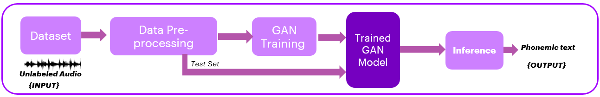
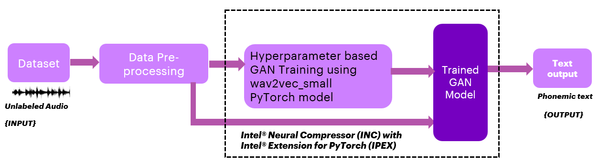
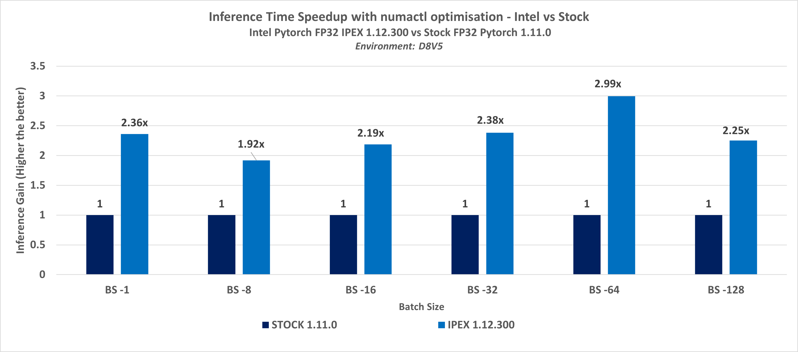

# Application of AI in transcribes for converting speech into text using PyTorch

## Table of Contents 
 - [Purpose](#purpose)
 - [Reference Solution](#reference-solution)
 - [Reference Implementation](#reference-implementation)
 - [Intel® Implementation](#optimizing-the-E2E-solution-with-Intel®-oneAPI)
 - [Performance Observations](#performance-observations)


## Purpose

Behavioral health-related issues require multiple therapy sessions, detailed Psychotherapy notes during the session, and subsequent analysis. In-depth analysis can often provide a root cause of symptoms such as low mood, lack of positive emotion, and other emotional and cognitive disorders attributable to substance abuse or personality disorders. Accurate analysis and prediction of conditions and symptoms can result in medication that can drive better outcomes for the patient. Regulations also require psychologists to create progress notes based on the therapy sessions that assist with : (source: https://footholdtechnology.com/news/mental-health-progress-notes/)

■ Helping therapist to keep track of each client and their treatment
<br>■ Coordinating care by communicating pertinent information to other members of the care team
<br>■ Maintaining a paper trail for agency audits and quality assurance
<br>■ Complying with professional obligations
<br>■ Billing for services

However, taking Psychotherapy notes, subsequent analysis, and writing detailed progress notes can consume up to half the time. With a growing rate of mental issues and a shortage of psychiatrists, appointments for therapy can be difficult, resulting in situations where patients that need care decline the service altogether. 

Our analysis of the market demand led us to two fundamental questions:
1. How can AI models drive higher productivity for psychologists?
2. How can these solutions be deployed at scale, reducing the time to implement the solution and the cost per outcome? 

AI technologies that convert speech to text can capture notes. We present a reference model that extends the capability further to contextualize the information and automate the generation of progress reports. A further enhancement is possible when paired with other predictive methodologies to analyze the results to provide the right course of action for the patient.   
Given the training, customization, and environmental requirements, such solutions need accelerations to deploy rapidly for many clients and keep the system updated for accuracy. This model further describes achieving such scale with the application of the AI Analytics toolkit.


# Reference Solution
Speech to Text conversion is one of the latest Cognitive solutions to be used in various Business, Personal & Medical use cases.  In the present reference kit, we are building a solution to convert 'Speech to Text' by leveraging a toolkit called 'Fairseq' (Facebook AI Research Sequence-to-Sequence Toolkit). 
Fairseq is a sequence modeling toolkit written in PyTorch that allows researchers and developers to train custom models for translation, summarization, language modeling, and other text generation tasks. It provides reference implementations of various sequence-to-sequence models, including Long Short-Term Memory (LSTM) networks and a novel convolutional neural network (CNN) that can generate translations many times faster than comparable recurrent neural network (RNN) models. It is developed by Meta. You can read more about [Fairseq](https://github.com/facebookresearch/fairseq).

<br>After data pre-processing with the help of the pre-trained models using Fairseq as a first step, we introduced Generative Adversarial Networks (GANs) training. These are a powerful class of neural networks used for unsupervised learning. In this reference kit, we introduced the PyTorch implementation of GAN training. GAN automatically learns and discovers patterns within data to build the first unsupervised ASR model (Automatic Speech Recognition). This step enables a program to transcribe spoken language (speech-to-text). Our goal is usually to have a model that minimizes the Word Error Rate (WER) metric when transcribing speech input.
This specific implementation of GAN used PyTorch, which includes a Generator and a Discriminator. 


### Key Implementation Details
The reference kit implementation is a reference solution to the described use case that includes:

1. A reference E2E architecture to arrive at an AI solution by leveraging the Fairseq toolkit
2. An Optimized reference E2E architecture enabled with Intel® Extension for PyTorch

## Reference Implementation

### E2E Architecture

Organizations are considering using API-based services that provide access to pre-trained models or leveraging transformers. However, such models continuously need to improve with new labeled data. Labeling data is a hugely time-consuming activity.
This is where the Unsupervised methods come to the rescue. Unsupervised Speech recognition can provide a better service option as it can handle large amounts of unlabeled and unstructured data. This makes it easier and faster to analyze complex data.



### Experiment Details
The experiment aims to convert speech into text by leveraging a sequence-to-sequence framework called Fairseq, which allows training custom models for translation, summarization, language modeling, and other text generation tasks. The experiment's goal is first to conduct a data preparation with the help of the Fairseq toolkit & a pre-trained model, then calculate the inference for benchmarking against Intel's technology.

Voice samples generally fall under unstructured data. The voice samples are subjected to pre-processing steps for preparing speech representations from unlabeled audio samples and learning a mapping from these representations to phonemes via GAN. The data preparation step is an essential procedure that enables the Generator to match speech to text in an unsupervised manner. Upon completion of the GAN training, we save the trained model. We also execute inference on this model as part of the benchmarking.

We break the reference into two key activities:<br>
1. Data preparation and training 
2. Inference.

The first step is data preparation of both speech & text data features. This step is essential to match speech to text in an unsupervised manner. The second step is pre-processing the unstructured voice samples into segmented unlabeled audio samples. We use the pe-trained wave2vecsmall.pt model, which helps learn basic speech units to tackle a self-supervised task. The model training further includes predicting the correct speech unit for masked audio parts while also discovering what the speech units should be. We applied K-Means Clustering and PCA to categorize audio/music by similar audio features.

In this experiment, we require English text corpus data. A speech corpus (or spoken corpus) is a database of speech audio files and text transcription. In speech technology, speech corpora are used, among other things, to represent the relationship between an audio signal and the phonemes, which helps in speech recognition. The next step is to prepare phonetic text data by setting the phonemizer to espeak (English only).

The second step is to run GAN training on top of the pre-processing features to map the representations to phonemes. We loop in new data to identify the best model.

Upon completion of the GAN training, the trained model becomes more accurate with the mapping. This model is then used as a baseline for inference to compare against Intel Technology.


### Expected Input-Output

**Input**                                 | **Output** |
| :---: | :---: |
| Patients' Voice samples                 | Phonemic text |

### Solution Summary:

|**Key Attribute**                  |**Description**
| :---                              | :---
| Industry                          | Medical (Psychotherapy)
| Dataset                            | Libri Speech Dataset with 5k voice samples , <br> Dev samples - 2.5k , <br> Test samples - 2.6k , <br> Data format - .flac & .wav , <br>
| Task                              | Convert Speech to Text
| Types of Learning                 | Unsupervised, Transfer Learning 
| Pre-trained models                | Wav2vec_small.pt 
| Frameworks used                   | fairseq-wave2vec U, Pykaldi, KenLM, rVAD
| Hardware                          | Intel IceLake CPU<br>
| Intel AI Software Portfolio       | Intel® Extension for PyTorch (IPEX)

## Reference Sources
**Case Study Reference**: https://github.com/pytorch/fairseq/tree/main/examples/wav2vec/unsupervised
<br>https://github.com/Open-Speech-EkStep/vakyansh-wav2vec2-experimentation

## GAN network Analysis

In a realistic scenario, the data scientists will run the same PyTorch-based model generated using the fairseq multiple times on the same dataset across different parameters. 

#### Default Parameters
In our scenario, we have 2 networks - A Generator and a Discriminator.  
| **Network**                       | **parameters**
| :---                              | :---
| Generator                         | `learning rate = 0.0004,`<br> `beta1 = 0.5 ,`<br> `beta2 = 0.98 ,`<br> `epsilon = 1e-06,`<br> `weight_decay = 0,` <br> 
| Discriminator                     | `learning rate = 0.0005,`<br> `beta1 = 0.5 ,`<br> `beta2 = 0.98 ,`<br> `epsilon = 1e-06,`<br> `weight_decay = 0,` <br> 

## Dataset
For this reference kit -we use the Librispeech dataset from Open SLR (http://www.openslr.org/12/). The data is fetched from Open SLR using a shell script. The shell script is adapted from -https://github.com/opendcd/opendcd/blob/master/egs/librispeech-get-data.sh
> *Please see this data set's applicable license for terms and conditions. Intel does not own the rights to this data set and does not confer any rights to it.*

Librispeech consists of audio samples based on LibriVox's public-domain audiobooks. Each sample in the dataset consists of voice samples read from audiobooks & used as a substitute to recreate patients' recorded voices during the therapy sessions.

### Software Requirements
1. Python -v3.8.10
2. PyTorch - v1.11.0
3. Fairseq
4. rVAD
5. PyKaldi
6. KenLM
7. Intel® Extension for PyTorch - v1.12.300
8. Intel® Neural Compressor- v1.14.1

Note that this reference kit implementation already provides the necessary scripts to setup the software requirements. To utilize these environment scripts, first install Anaconda by following the instructions at the following link:
[Anaconda installation](https://docs.anaconda.com/anaconda/install/linux/) <br>
**Note: If the conda is installed using pip, it will not work for this purpose. So please install conda from the above link only.**

Set the PATH environment variable:
```
export PATH=~/anaconda3/bin:$PATH
```

### ***Solution setup***

This reference kit involves some pre-requisite steps (Initial  Steps) to be followed before we start the benchmarking.


## Repository Clone:
```sh
git clone https://github.com/oneapi-src/ai-transcribe
```

## Data Pre-processing Steps:

#### Creation of a new environment for Data Pre-processing
It is recommended to deactivate all the existing conda environments and create a separate environment (other than the base) to carry out pre-processing steps to avoid the occurrence of any environmental issues later on.
```sh
conda create --name preprocessing
```
Once the environment is created, activate the environment by the following command:

```sh
conda activate preprocessing
```

### 1. Cloning the Fairseq repo & adding the patch

```sh
cd src
git clone https://github.com/facebookresearch/fairseq
cd fairseq
git reset --hard 97b2d8153babe06d3580add6eb512c7e2fbc0fc6
git apply --reject --whitespace=fix  ../fairseq_patch.patch
apt install g++ -y
sudo apt-get install libgl1 -y
pip install --editable ./
cd ..
```

### 2. Install E-Speak:

```sh
cd src
apt-get install espeak -y
```

### ** Note: Installation of rVAD, Pykaldi, kenlm, FFTW & Flashlight should be carried outside the fairseq folder i.e. in the src folder** 

3. Install rVAD. rVAD is Matlab and Python library for an unsupervised method for robust voice activity detection (rVAD)

```sh
cd src
git clone https://github.com/zhenghuatan/rVADfast.git
```

### 4. Installation of PyKaldi
PyKaldi and all of its Python dependencies' should be installed in an isolated environment. 

#### Creation of a new environment for PyKaldi:
```sh
conda create --name pykaldienv python=3.8.10
```
Once the environment is created, activate the environment by the following command:

```sh
conda activate pykaldienv
```
Follow the below steps for PyKaldi installation:<br>

#### a.To install PyKaldi from the source, follow the steps given below.
```sh
cd src
git clone https://github.com/pykaldi/pykaldi.git
cd pykaldi
```
#### b. Install Dependencies
```sh
# Ubuntu
sudo apt-get install autoconf automake cmake curl g++ git graphviz \
    libatlas3-base libtool make pkg-config subversion unzip wget zlib1g-dev
``` 
#### c. Running the commands below will install the Python packages needed for building PyKaldi from the source.

```sh
pip install --upgrade pip
pip install --upgrade setuptools
pip install numpy pyparsing
pip install ninja  # not required but strongly recommended
```
```sh
cd tools
sudo apt-get install sox gfortran python2.7
./check_dependencies.sh  # checks if system dependencies are installed
./install_protobuf.sh    # installs both the C++ library and the Python package
./install_clif.sh       # installs both the C++ library and the Python package
sudo chmod 775 install_mkl.sh
./install_mkl.sh       # installs the Math Kernel library-related dependencies for Pykaldi installation
./install_kaldi.sh       # installs the C++ library
cd ..
```
Once the PyKaldi installation is over, deactivate the pykaldienv environment.
```sh
conda deactivate
```

### 5. Installation of kenlm

```sh
cd src
wget -O - https://kheafield.com/code/kenlm.tar.gz |tar xz
sudo apt-get install libboost-all-dev
sudo apt-get -y install libeigen3-dev liblzma-dev zlib1g-dev libbz2-dev
sudo apt-get install bzip2
``` 
### 6. Building kenlm
```sh
mkdir kenlm/build
cd kenlm/build
cmake ..
make -j2
```
### 7. Installation of Flashlight

We need to install FFTW first before we install Flashlight. Download FFTW outside fairseq, inside src & extract the file. 

```sh
cd src
wget http://www.fftw.org/fftw-3.3.10.tar.gz
tar -xvzf "fftw-3.3.10.tar.gz"
cd fftw-3.3.10 
./configure
make
sudo make install
mkdir build && cd build
cmake ..
make -j 4
sudo make install
sudo cp FFTW3LibraryDepends.cmake /usr/local/lib/cmake/fftw3/
```
Navigate back to src:
```sh
cd src
git clone https://github.com/flashlight/flashlight.git
```
Please follow the below steps to install MKL:
```sh
cd /tmp && wget https://apt.repos.intel.com/intel-gpg-keys/GPG-PUB-KEY-INTEL-SW-PRODUCTS-2019.PUB && \
    sudo apt-key add GPG-PUB-KEY-INTEL-SW-PRODUCTS-2019.PUB && \
    sh -c 'echo deb https://apt.repos.intel.com/mkl all main > /etc/apt/sources.list.d/intel-mkl.list' && \
    sudo apt-get update && \
    sudo apt install intel-mkl-64bit-2020.4-912

cd ..
```
Also, set the environment variables:

export MKLROOT="/opt/intel/mkl" <br>
export USE_CUDA=0  <br>
export USE_KENLM=0  <br>
export USE_MKL=1 <br>

```sh
cd flashlight/bindings/python
pip install packaging
python3 setup.py install
pip3 install -e .
``` 

The folder structure should be as shown below:
```sh
- assests
- data
- logs
- src
  - fairseq
  - fftw-3.3.10
  - flashlight
  - kenlm
  - pykaldi
  - rVADfast
  - inference_script
  - Training_Intel.sh
  - Training_Stock.sh
  - Inference_Stock.sh

  ```

### 8. Download the pre-trained models:

```sh
cd fairseq
wget https://dl.fbaipublicfiles.com/fasttext/supervised-models/lid.176.bin
wget https://dl.fbaipublicfiles.com/fairseq/wav2vec/wav2vec_small.pt
``` 

### 9. Dataset download:
Please execute the below commands:
```sh
cd ..
cd data
sh data.sh 
```
Navigate inside the LibriSpeech folder:
```sh
cd LibriSpeech
```
It should have the below folder structure:
```
LibriSpeech
  |--- dev-clean
  |--- test-clean

```

### 10. Set the required flags by giving the absolute paths:

```sh
cd src/fairseq
export FAIRSEQ_ROOT="<absolute path of cloned fairseq>"
export RVAD_ROOT="<absolute path of rVAD installation>/rVADfast"
export KENLM_ROOT="<absolute path of kenlm installation>/kenlm/build/bin"
export KALDI_ROOT="<absolute path of pykaldi installation>/pykaldi/tools/kaldi"
export LD_LIBRARY_PATH="<absolute path of the miniconda/conda installation>/lib:/<absolute path of the pykaldi installation>/tools/kaldi/tools/openfst-1.6.7/lib:/<absolute path of the pykaldi installation>/tools/kaldi/src/lib"
export PYTHONPATH=$PYTHONPATH:$FAIRSEQ_ROOT/examples

``` 
Note: --> Please give the absolute path of the minconda3/conda installation while setting the LD_LIBRARY_PATH depending on your setup.

For example:
```
export LD_LIBRARY_PATH="/home/abcuser/miniconda3/lib:/home/abcuser/src/pykaldi/tools/kaldi/tools/openfst-1.6.7/lib:/home/abcuser/src/pykaldi/tools/kaldi/src/lib
```

### 11. Installation of some dependent Python libraries in the pre-process environment:
```sh
pip install torch==1.11.0+cpu --extra-index-url https://download.pytorch.org/whl/cpu
pip install torchaudio==0.11.0 --extra-index-url https://download.pytorch.org/whl/cpu
pip install soundfile==0.10.3.post1
pip install npy-append-array==0.9.13
pip install phonemizer
pip install faiss-cpu
```

### 12. Audio data pre-process:  
Run the following command to preprocess the audio data and generate a tsv file.
```sh
python $FAIRSEQ_ROOT/examples/wav2vec/wav2vec_manifest.py /<absolute path of the repo>/data/LibriSpeech/dev-clean --ext flac --dest ./preprocessed_level1 --valid-percent 0
``` 
Check that the preprocessed_level1 folder is generated with the train.tsv 


13. Run the following command to generate the vads file.

```sh
python $FAIRSEQ_ROOT/examples/wav2vec/unsupervised/scripts/vads.py -r $RVAD_ROOT <./preprocessed_level1/train.tsv> ./preprocessed_level1/train.vads

``` 


14. Run the following command to remove silence from audio samples.

```sh
python $FAIRSEQ_ROOT/examples/wav2vec/unsupervised/scripts/remove_silence.py --tsv ./preprocessed_level1/train.tsv --vads ./preprocessed_level1/train.vads --out ./removed_silence_data
``` 


15. Again run the manifest file to generate the train.tsv file with a validation percentage of 0.3

```sh
python $FAIRSEQ_ROOT/examples/wav2vec/wav2vec_manifest.py ./removed_silence_data --ext flac --dest ./preprocessed_level2 --valid-percent 0.3
``` 
Check that valid.tsv and train.tsv files are generated in the preprocessed_level2 folder


### 16.Audio pre-processing to match phonemicized text data 
Next, we need to preprocess the audio data to better match phonemicized text data.
```sh
zsh $FAIRSEQ_ROOT/examples/wav2vec/unsupervised/scripts/prepare_audio.sh ./preprocessed_level2 ./prepared_audio wav2vec_small.pt
```
 

### 17. Preparation of text data:

Execute the below commands to download and extract the English corpus data.
```sh
cd fairseq
mkdir corpusdata
cd corpusdata
wget https://pcai056.informatik.uni-leipzig.de/downloads/corpora/eng_news_2005_10K.tar.gz 
tar -xvf eng_news_2005_10K.tar.gz
cd ..
```

```sh
zsh $FAIRSEQ_ROOT/examples/wav2vec/unsupervised/scripts/prepare_text.sh en /<absolute path of repo>/src/fairseq/corpusdata/eng_news_2005_10K-sentences.txt /<absolute path of the cloned fairseq>/prepared_text 100 espeak lid.176.bin
 
```

This is a one-time activity for preparing text phenomes. The same can be used repeatedly for different experiments.
Once the text data is prepared, we need to copy the dict.phn.txt from the phones folder under the prepared_text folder to the precompute_pca512_cls128_mean_pooled folder under prepared_audio.

```sh
cp <absolute path of fairseq>/prepared_text/phones/dict.phn.txt <absolute path of fairseq>/prepared_audio/precompute_pca512_cls128_mean_pooled
cp <absolute path of fairseq>/prepared_text/phones/dict.phn.txt <absolute path of fairseq>/prepared_audio/
```

Deactivate the preprocessing environment:
```sh
conda deactivate
```
## Stock environment setup

Follow the below conda installation commands to setup the stock environment for model training and prediction.

### Note:
Deactivate all the other environments including the base before creating the stock environment. Showing for the base environment here.

```sh
(base) abcuser:~$ conda deactivate
```
>Note: It is assumed that the present working directory is the root directory of this code repository

```sh
conda env create --file env/stock/speech-stock.yml
```
conda environment called speech-stock would be created after running this.

This command utilizes the dependencies found in the `env/stock/speech-stock.yml` file to create an environment as follows:

**YAML file**                              | **Environment Name**         |  **Configuration** |
| :---: | :---: | :---: |
| `env/stock/speech-stock.yml`             | speech-stock                | Python=3.8.10 with PyTorch 1.11.0

Use the following command to activate the stock environment:
```sh
conda activate speech-stock
```
### Additional steps for Stock Environment setup :
Please run the below commands once the environment is activated :
```sh
cd fairseq
pip install --editable ./
pip install https://github.com/kpu/kenlm/archive/master.zip
pip install editdistance
sudo apt install numactl
```

## Setting Epochs 

**Configuration** <br>
Before we start Training, we need to set the no. of epochs in the config file called w2vu.yaml. It can be found in the below path:

Path: /examples/wav2vec/unsupervised/config/gan

Open the file and head to the optimization section. Here we need to update max_update & max_epoch. We carried out some experiments & found some apt values for these parameters. 

```sh
N = (no. of Epochs) / 50
max_update = 950 x N
```
It is better to give the value of epochs in the multiples (N) of 50. Let's say that we decided to run for 100 epochs. In that case, N would turn out to be 2. Then the max_update would be 1900.

```sh
optimization:
  max_update: 1900
  max_epoch : 100
  clip_norm: 5.0
  lr: [0]
```

## Benchmarking :
One of the important aspects in this enterprise scenario is to improve the MLOps time for developing and deploying new models due to its ever-increasing size of datasets over a period. To address this, the Intel® One API libraries - Intel PyTorch Extension (IPEX) & Intel Neural Compressor (INC) benchmarked against stock libraries. Benchmarking experiments are done for Inference. Inference Benchmarking scripts are placed in the src folder.

### Model building process

Open the Training_Stock.sh script in src folder. Update the respective paths of TASK_DATA, TEXT_DATA, KENLM_PATH, OUT_PATH & CONFIG_PATH with their absolute paths. 

```sh
# Path to prepared_audio/precompute_pca512_cls128_mean_pooled - Prepared Audio 
TASK_DATA='<absolute path of cloned fairseq>/prepared_audio/precompute_pca512_cls128_mean_pooled'

# path to fairseq-preprocessed GAN data (phones dir) - Prepared Text data
TEXT_DATA='<absolute path of cloned fairseq>/prepared_text/phones'

# KenLM 4-gram phoneme language model (LM data = GAN data here)
KENLM_PATH='<absolute path of  cloned fairseq>/prepared_text/phones/lm.phones.filtered.04.bin'

# Path where the trained model will be saved
OUT_PATH='<absolute path of cloned fairseq>/model'

# Path to the config file of the unsupervised gan model
CONFIG_PATH='<absolute path of cloned fairseq >/examples/wav2vec/unsupervised/config/gan'
```

Run the Training_Stock.sh file to start the training.

```sh
cd src
sh Training_stock.sh
```

**Expected Output**<br>
Training time in seconds would be generated at the end of the training module. For example, here it is 5834.

```
start time >>>>>>>>>>>>>>>>>>>>>>>>>>>>>>>>>>>>>>>>>>>>>>>>>>>>>>>>>>>>>>>>>>>>>>>>>>>>>>>>>>>>>>>>>>: 05:14:52 AM
Current start time : 05:14:52
/src/gan_out
[2022-06-30 05:15:39,242][HYDRA] Launching 60 jobs locally
.......................................................
......................................................
Current end  time................................... : 06:52:06
5834
end time >>>>>>>>>>>>>>>>>>>>>>>>>>>>>>>>>>>>>>>>>>>>>>>>>>>>>>>>>>>>>>>>>>>>>>>>>>>>>>>>>>>>>>>>>>>>>>>: 06:52:06 AM
```


**Stock Inference Benchmarking**

Once the models are saved, we need to use them for inferencing. Open the 'Inference_Stock.sh' file in the src folder. 
Set the respective path for TASK_DATA, MODEL_PATH & test_eval_result. Also, batch size can be set using fairseq.dataset.batch_size


```sh
# Path to audio/precompute_pca512_cls128_mean_pooled  
TASK_DATA='<absolute path of cloned fairseq>/prepared_audio/precompute_pca512_cls128_mean_pooled'

#Stock Model - please give the same path where the model was saved earlier during training
MODEL_PATH='<absolute path of cloned fairseq>/model/checkpoint_best.pt'


test_eval_result="<absolute path of clonned repo>/test_eval_result"

# To set the batch size.  
fairseq.dataset.batch_size=1 \

```

We perform Inference with Numactl optimization.Numactl is used to bind the processes to a certain number of cores in the processor & also to bind the memory to certain nodes.

Note we need to be in fairseq folder to run the inference as we have built the fairseq from there.
```sh
cd src/fairseq
```

#### Inference with Numactl optimization:<br>
```sh
numactl -C "0-3" --membind=0 sh ../Inference_Stock.sh 
```
Here the processes are confined to 4 cores of the CPU and we use only the first node of disk memory. Similarly, depending on your system's configuration, you can modify the command accordingly.

### Expected Output

Inference time in seconds would be generated at the end of the execution. A sample inference log is shown below:

```
[2022-10-18 12:36:46,598][__main__][INFO] - {'_name': None, 'fairseq': {'_name': None, 'common': {'_name': None, 'no_progress_bar': False, 'log_interval': 100, 'log_format': None, 'log_file': None, 'aim_repo': None, 'aim_run_hash': None, 'tensorboard_logdir': None, 'wandb_project': None, 'azureml_logging': False, 'seed': 1, 'cpu': True, 'intel': False, 'inc': True, 'tpu': False, 'bf16': False, 'memory_efficient_bf16': False, 'fp16': False, 'memory_efficient_fp16': False, 'fp16_no_flatten_grads': False, 'fp16_init_scale': 128, 'fp16_scale_window': None, 'fp16_scale_tolerance': 0.0, 'on_cpu_convert_precision': False, 'min_loss_scale': 0.0001, 'threshold_loss_scale': None, 'amp': False, 'amp_batch_retries': 2, 'amp_init_scale': 128, 'amp_scale_window': None, 'user_dir': '/home/azureuser/fairseq1/examples/wav2vec/unsupervised/', 'empty_cache_freq': 0, 'all_gather_list_size': 16384, 'model_parallel_size': 1, 'quantization_config_path': None, 'profile': False, 'reset_logging': False, 'suppress_crashes': False, 'use_plasma_view': False, 'plasma_path': '/tmp/plasma'}, 'common_eval': {'_name': None, 'path': '/home/azureuser/Speech_Patch/output_models_stock/gan_out/checkpoint_best.pt', 'post_process': None, 'quiet': True, 'model_overrides': '{}', 'results_path': None}, 'distributed_training': {'_name': None, 'distributed_world_size': 1, 'distributed_num_procs': 1, 'distributed_rank': 0, 'distributed_backend': 'nccl', 'distributed_init_method': None, 'distributed_port': -1, 'device_id': 0, 'distributed_no_spawn': False, 'ddp_backend': pytorch_ddp, 'ddp_comm_hook': none, 'bucket_cap_mb': 25, 'fix_batches_to_gpus': False, 'find_unused_parameters': False, 'gradient_as_bucket_view': False, 'fast_stat_sync': False, 'heartbeat_timeout': -1, 'broadcast_buffers': False, 'slowmo_momentum': None, 'slowmo_base_algorithm': 'localsgd', 'localsgd_frequency': 3, 'nprocs_per_node': 1, 'pipeline_model_parallel': False, 'pipeline_balance': None, 'pipeline_devices': None, 'pipeline_chunks': 0, 'pipeline_encoder_balance': None, 'pipeline_encoder_devices': None, 'pipeline_decoder_balance': None, 'pipeline_decoder_devices': None, 'pipeline_checkpoint': never, 'zero_sharding': none, 'fp16': '${common.fp16}', 'memory_efficient_fp16': '${common.memory_efficient_fp16}', 'tpu': '${common.tpu}', 'no_reshard_after_forward': False, 'fp32_reduce_scatter': False, 'cpu_offload': False, 'use_sharded_state': False, 'not_fsdp_flatten_parameters': False}, 'dataset': {'_name': None, 'num_workers': 1, 'skip_invalid_size_inputs_valid_test': False, 'max_tokens': 130695, 'batch_size': 4096, 'required_batch_size_multiple': 8, 'required_seq_len_multiple': 1, 'dataset_impl': None, 'data_buffer_size': 10, 'train_subset': 'train', 'valid_subset': 'valid', 'combine_valid_subsets': None, 'ignore_unused_valid_subsets': False, 'validate_interval': 1, 'validate_interval_updates': 0, 'validate_after_updates': 0, 'fixed_validation_seed': None, 'disable_validation': False, 'max_tokens_valid': '${dataset.max_tokens}', 'batch_size_valid': '${dataset.batch_size}', 'max_valid_steps': None, 'curriculum': 0, 'gen_subset': 'train', 'num_shards': 1, 'shard_id': 0, 'grouped_shuffling': False, 'update_epoch_batch_itr': '${dataset.grouped_shuffling}', 'update_ordered_indices_seed': False}, 'optimization': {'_name': None, 'max_epoch': 0, 'max_update': 0, 'stop_time_hours': 0.0, 'clip_norm': 0.0, 'sentence_avg': False, 'update_freq': [1], 'lr': [0.25], 'stop_min_lr': -1.0, 'use_bmuf': False, 'skip_remainder_batch': False}, 'checkpoint': {'_name': None, 'save_dir': 'checkpoints', 'restore_file': 'checkpoint_last.pt', 'continue_once': None, 'finetune_from_model': None, 'reset_dataloader': False, 'reset_lr_scheduler': False, 'reset_meters': False, 'reset_optimizer': False, 'optimizer_overrides': '{}', 'save_interval': 1, 'save_interval_updates': 0, 'keep_interval_updates': -1, 'keep_interval_updates_pattern': -1, 'keep_last_epochs': -1, 'keep_best_checkpoints': -1, 'no_save': False, 'no_epoch_checkpoints': False, 'no_last_checkpoints': False, 'no_save_optimizer_state': False, 'best_checkpoint_metric': 'loss', 'maximize_best_checkpoint_metric': False, 'patience': -1, 'checkpoint_suffix': '', 'checkpoint_shard_count': 1, 'load_checkpoint_on_all_dp_ranks': False, 'write_checkpoints_asynchronously': False, 'model_parallel_size': '${common.model_parallel_size}'}, 'bmuf': {'_name': None, 'block_lr': 1.0, 'block_momentum': 0.875, 'global_sync_iter': 50, 'warmup_iterations': 500, 'use_nbm': False, 'average_sync': False, 'distributed_world_size': '${distributed_training.distributed_world_size}'}, 'generation': {'_name': None, 'beam': 5, 'nbest': 1, 'max_len_a': 0.0, 'max_len_b': 200, 'min_len': 1, 'match_source_len': False, 'unnormalized': False, 'no_early_stop': False, 'no_beamable_mm': False, 'lenpen': 1.0, 'unkpen': 0.0, 'replace_unk': None, 'sacrebleu': False, 'score_reference': False, 'prefix_size': 0, 'no_repeat_ngram_size': 0, 'sampling': False, 'sampling_topk': -1, 'sampling_topp': -1.0, 'constraints': None, 'temperature': 1.0, 'diverse_beam_groups': -1, 'diverse_beam_strength': 0.5, 'diversity_rate': -1.0, 'print_alignment': None, 'print_step': False, 'lm_path': None, 'lm_weight': 0.0, 'iter_decode_eos_penalty': 0.0, 'iter_decode_max_iter': 10, 'iter_decode_force_max_iter': False, 'iter_decode_with_beam': 1, 'iter_decode_with_external_reranker': False, 'retain_iter_history': False, 'retain_dropout': False, 'retain_dropout_modules': None, 'decoding_format': None, 'no_seed_provided': False, 'eos_token': None}, 'eval_lm': {'_name': None, 'output_word_probs': False, 'output_word_stats': False, 'context_window': 0, 'softmax_batch': 9223372036854775807}, 'interactive': {'_name': None, 'buffer_size': 0, 'input': '-'}, 'model': '???', 'task': {'_name': 'unpaired_audio_text', 'labels': 'phn', 'data': '/home/azureuser/fairseq1/inference_scripts/test_data/precompute_pca512_cls128_mean_pooled', 'sort_by_length': False, 'shuffle': False, 'text_data': ''}, 'criterion': None, 'optimizer': None, 'lr_scheduler': None, 'scoring': None, 'bpe': None, 'tokenizer': None, 'ema': {'_name': None, 'store_ema': False, 'ema_decay': 0.9999, 'ema_start_update': 0, 'ema_seed_model': None, 'ema_update_freq': 1, 'ema_fp32': False}}, 'lm_weight': 2.0, 'w2l_decoder': <DecoderType.VITERBI: 1>, 'kaldi_decoder_config': None, 'lexicon': None, 'lm_model': None, 'unit_lm': False, 'beam_threshold': 50.0, 'beam_size_token': 100.0, 'beam': 1500, 'nbest': 1, 'word_score': 1.0, 'unk_weight': -inf, 'sil_weight': 0.0, 'targets': 'wrd', 'results_path': '/home/azureuser/test_env_eval_result_50_epochs_stock', 'post_process': 'silence', 'vocab_usage_power': 2.0, 'viterbi_transcript': None, 'min_lm_ppl': 0.0, 'min_vt_uer': 0.0, 'blank_weight': 0.0, 'blank_mode': 'set', 'sil_is_blank': False, 'unsupervised_tuning': False, 'is_ax': False, 'job_logging_cfg': {'version': 1, 'formatters': {'simple': {'format': '[%(asctime)s][%(name)s][%(levelname)s] - %(message)s'}}, 'handlers': {'console': {'class': 'logging.StreamHandler', 'formatter': 'simple', 'stream': 'ext://sys.stdout'}, 'file': {'class': 'logging.FileHandler', 'formatter': 'simple', 'filename': 'w2vu_generate.log'}}, 'root': {'level': 'INFO', 'handlers': ['console', 'file']}, 'disable_existing_loggers': False}}
[2022-10-18 12:36:46,614][__main__][INFO] - | loading model(s) from /home/azureuser/Speech_Patch/output_models_stock/gan_out/checkpoint_best.pt

Batch Size used here is  1
Average Inference Time Taken Fp32 -->  0.4967531681060791
```

## **Optimizing the E2E solution with Intel® Extension for PyTorch**

Although AI delivers a solution to address AI-based Transcribe, on a production scale implementation with millions or billions of voice samples demands more compute power without leaving any performance on the table. Under this scenario, speech-to-text models are essential for identifying and extracting entities which will enable the analyst to take appropriate decisions. In order to derive the most insightful and beneficial actions to take, they will need to study and analyze the data generated through various feature sets and algorithms, usage of some of the cutting edge frameworks thus requiring frequent re-runs of the algorithms under many different parameter sets. To utilize all the hardware resources efficiently, Software optimizations cannot be ignored.

This reference kit solution extends to demonstrate the advantages of using the Intel AI Analytics Toolkit on the task of building a model for speech-to-text conversion. The savings gained from using the Intel optimizations for PyTorch can lead an analyst to more efficiently explore and understand data, leading to better and more precisely targeted solutions when it comes to conversion of Speech to Text use cases.



### **Optimized software components** 

### Intel®  Extension for PyTorch (IPEX)
Intel® Extension for PyTorch* extends PyTorch with optimizations for an extra performance boost on Intel hardware.Intel® Extension for PyTorch* is loaded as a Python module for Python programs or linked as a C++ library for C++ programs. Designed for data scientists & machine learning engineers, Intel® Extension for PyTorch is a seamless way to speed up your applications for machine learning to solve real-world problems.

## Software Requirements
| Package                              | **Intel® Python**         
| :---: | :---: 
| Python                                  | 3.8.10  |       
| Intel® Extension for PyTorch                 | 1.12.300 |    


### Optimized Solution setup <br>
Follow the below conda installation commands for environment creation and inference.

>Note: It is assumed that the present working directory is the root directory of this code repository

Deactivate all the other environments including base before creating the intel-environment. Showing for base environment here.
Similarly please do it for all the other existing environments.

```sh
conda deactivate
```
Run the below command to create speech-intel environment:
```sh
conda env create --file env/intel/speech-intel.yml
```

This command utilizes the dependencies found in the `env/intel/speech-intel.yml` file to create an environment as follows:

**YAML file**                              | **Environment Name**         |  **Configuration** |
| :---: | :---: | :---: |
| `env/intel/speech-intel.yml`             | speech-intel                | Python=3.8.10 with Intel® Extension for PyTorch (IPEX) 1.12.300


Use the following command to activate the environment that was created:
```sh
conda activate speech-intel
```
### Additional steps:
Please run the below commands once the environment is activated :
```sh
cd fairseq
pip install --editable ./
pip install https://github.com/kpu/kenlm/archive/master.zip
pip install editdistance
```

### Optimized Solution Implementation

## Model Inference process with Intel® optimizations - 
The stock model generated is utilized for inference in the Intel environment also. It is quantized to provide faster inference using Intel® Neural Compressor (INC). INC is an open-source Python library that runs on Intel CPUs and GPUs and delivers unified interfaces across multiple deep-learning frameworks for popular network compression technologies such as quantization, pruning, and knowledge distillation.
INC is used to quantize the FP32 Model to the INT8 Model. This also reduces the model size. In the present context, INC along with Intel® Extension for PyTorch (IPEX 1.12.300) is used for benchmarking.

Open Inference_Intel.sh shell script in src folder. 
Set the respective path for TASK_DATA, MODEL_PATH & test_eval_result. Also batch size can be set using 'fairseq.dataset.batch_size'.

```sh
# Path to audio/precompute_pca512_cls128_mean_pooled  
TASK_DATA='<absolute path of cloned fairseq>/prepared_audio/precompute_pca512_cls128_mean_pooled'

# Model
MODEL_PATH='<absolute path of cloned fairseq>/model/stock/checkpoint_best.pt'

test_eval_result="<absolute path of repo>/test_eval_result"

# To set the batch size.  
fairseq.dataset.batch_size=1 \
```
Note we need to be in fairseq folder to run the inference as we have built the fairseq from there.
```sh
cd src/fairseq
```

#### Inference with Numactl optimization:<br>
```sh
numactl -C "0-3" --membind=0 sh ../Inference_Intel.sh 
```

### Expected Output
Inference time of FP32 in seconds would be generated at the end of the execution. Sample output as shown below:

```sh
[2022-09-30 04:54:34,363][__main__][INFO] - {'_name': None, 'fairseq': {'_name': None, 'common': {'_name': None, 'no_progress_bar': False, 'log_interval': 100, 'log_format': None, 'log_file': None, 'aim_repo': None, 'aim_run_hash': None, 'tensorboard_logdir': None, 'wandb_project': None, 'azureml_logging': False, 'seed': 1, 'cpu': True, 'intel': True, 'inc': True, 'tpu': False, 'bf16': False, 'memory_efficient_bf16': False, 'fp16': False, 'memory_efficient_fp16': False, 'fp16_no_flatten_grads': False, 'fp16_init_scale': 128, 'fp16_scale_window': None, 'fp16_scale_tolerance': 0.0, 'on_cpu_convert_precision': False, 'min_loss_scale': 0.0001, 'threshold_loss_scale': None, 'amp': False, 'amp_batch_retries': 2, 'amp_init_scale': 128, 'amp_scale_window': None, 'user_dir': '/home/azureuser/fairseq1/examples/wav2vec/unsupervised/', 'empty_cache_freq': 0, 'all_gather_list_size': 16384, 'model_parallel_size': 1, 'quantization_config_path': None, 'profile': False, 'reset_logging': False, 'suppress_crashes': False, 'use_plasma_view': False, 'plasma_path': '/tmp/plasma'}, 'common_eval': {'_name': None, 'path': '/home/azureuser/Speech_Patch/output_models_intel/gan_out/checkpoint_last.pt', 'post_process': None, 'quiet': True, 'model_overrides': '{}', 'results_path': None}, 'distributed_training': {'_name': None, 'distributed_world_size': 1, 'distributed_num_procs': 1, 'distributed_rank': 0, 'distributed_backend': 'nccl', 'distributed_init_method': None, 'distributed_port': -1, 'device_id': 0, 'distributed_no_spawn': False, 'ddp_backend': pytorch_ddp, 'ddp_comm_hook': none, 'bucket_cap_mb': 25, 'fix_batches_to_gpus': False, 'find_unused_parameters': False, 'gradient_as_bucket_view': False, 'fast_stat_sync': False, 'heartbeat_timeout': -1, 'broadcast_buffers': False, 'slowmo_momentum': None, 'slowmo_base_algorithm': 'localsgd', 'localsgd_frequency': 3, 'nprocs_per_node': 1, 'pipeline_model_parallel': False, 'pipeline_balance': None, 'pipeline_devices': None, 'pipeline_chunks': 0, 'pipeline_encoder_balance': None, 'pipeline_encoder_devices': None, 'pipeline_decoder_balance': None, 'pipeline_decoder_devices': None, 'pipeline_checkpoint': never, 'zero_sharding': none, 'fp16': '${common.fp16}', 'memory_efficient_fp16': '${common.memory_efficient_fp16}', 'tpu': '${common.tpu}', 'no_reshard_after_forward': False, 'fp32_reduce_scatter': False, 'cpu_offload': False, 'use_sharded_state': False, 'not_fsdp_flatten_parameters': False}, 'dataset': {'_name': None, 'num_workers': 1, 'skip_invalid_size_inputs_valid_test': False, 'max_tokens': 130695, 'batch_size': 1, 'required_batch_size_multiple': 8, 'required_seq_len_multiple': 1, 'dataset_impl': None, 'data_buffer_size': 10, 'train_subset': 'train', 'valid_subset': 'valid', 'combine_valid_subsets': None, 'ignore_unused_valid_subsets': False, 'validate_interval': 1, 'validate_interval_updates': 0, 'validate_after_updates': 0, 'fixed_validation_seed': None, 'disable_validation': False, 'max_tokens_valid': '${dataset.max_tokens}', 'batch_size_valid': '${dataset.batch_size}', 'max_valid_steps': None, 'curriculum': 0, 'gen_subset': 'train', 'num_shards': 1, 'shard_id': 0, 'grouped_shuffling': False, 'update_epoch_batch_itr': '${dataset.grouped_shuffling}', 'update_ordered_indices_seed': False}, 'optimization': {'_name': None, 'max_epoch': 0, 'max_update': 0, 'stop_time_hours': 0.0, 'clip_norm': 0.0, 'sentence_avg': False, 'update_freq': [1], 'lr': [0.25], 'stop_min_lr': -1.0, 'use_bmuf': False, 'skip_remainder_batch': False}, 'checkpoint': {'_name': None, 'save_dir': 'checkpoints', 'restore_file': 'checkpoint_last.pt', 'continue_once': None, 'finetune_from_model': None, 'reset_dataloader': False, 'reset_lr_scheduler': False, 'reset_meters': False, 'reset_optimizer': False, 'optimizer_overrides': '{}', 'save_interval': 1, 'save_interval_updates': 0, 'keep_interval_updates': -1, 'keep_interval_updates_pattern': -1, 'keep_last_epochs': -1, 'keep_best_checkpoints': -1, 'no_save': False, 'no_epoch_checkpoints': False, 'no_last_checkpoints': False, 'no_save_optimizer_state': False, 'best_checkpoint_metric': 'loss', 'maximize_best_checkpoint_metric': False, 'patience': -1, 'checkpoint_suffix': '', 'checkpoint_shard_count': 1, 'load_checkpoint_on_all_dp_ranks': False, 'write_checkpoints_asynchronously': False, 'model_parallel_size': '${common.model_parallel_size}'}, 'bmuf': {'_name': None, 'block_lr': 1.0, 'block_momentum': 0.875, 'global_sync_iter': 50, 'warmup_iterations': 500, 'use_nbm': False, 'average_sync': False, 'distributed_world_size': '${distributed_training.distributed_world_size}'}, 'generation': {'_name': None, 'beam': 5, 'nbest': 1, 'max_len_a': 0.0, 'max_len_b': 200, 'min_len': 1, 'match_source_len': False, 'unnormalized': False, 'no_early_stop': False, 'no_beamable_mm': False, 'lenpen': 1.0, 'unkpen': 0.0, 'replace_unk': None, 'sacrebleu': False, 'score_reference': False, 'prefix_size': 0, 'no_repeat_ngram_size': 0, 'sampling': False, 'sampling_topk': -1, 'sampling_topp': -1.0, 'constraints': None, 'temperature': 1.0, 'diverse_beam_groups': -1, 'diverse_beam_strength': 0.5, 'diversity_rate': -1.0, 'print_alignment': None, 'print_step': False, 'lm_path': None, 'lm_weight': 0.0, 'iter_decode_eos_penalty': 0.0, 'iter_decode_max_iter': 10, 'iter_decode_force_max_iter': False, 'iter_decode_with_beam': 1, 'iter_decode_with_external_reranker': False, 'retain_iter_history': False, 'retain_dropout': False, 'retain_dropout_modules': None, 'decoding_format': None, 'no_seed_provided': False, 'eos_token': None}, 'eval_lm': {'_name': None, 'output_word_probs': False, 'output_word_stats': False, 'context_window': 0, 'softmax_batch': 9223372036854775807}, 'interactive': {'_name': None, 'buffer_size': 0, 'input': '-'}, 'model': '???', 'task': {'_name': 'unpaired_audio_text', 'labels': 'phn', 'data': '/home/azureuser/fairseq1/inference_scripts/test_data/precompute_pca512_cls128_mean_pooled', 'sort_by_length': False, 'shuffle': False, 'text_data': ''}, 'criterion': None, 'optimizer': None, 'lr_scheduler': None, 'scoring': None, 'bpe': None, 'tokenizer': None, 'ema': {'_name': None, 'store_ema': False, 'ema_decay': 0.9999, 'ema_start_update': 0, 'ema_seed_model': None, 'ema_update_freq': 1, 'ema_fp32': False}}, 'lm_weight': 2.0, 'w2l_decoder': <DecoderType.VITERBI: 1>, 'kaldi_decoder_config': None, 'lexicon': None, 'lm_model': None, 'unit_lm': False, 'beam_threshold': 50.0, 'beam_size_token': 100.0, 'beam': 1500, 'nbest': 1, 'word_score': 1.0, 'unk_weight': -inf, 'sil_weight': 0.0, 'targets': 'wrd', 'results_path': '/home/azureuser/Speech_Patch/eval/env_eval_result_epochs_intel', 'post_process': 'silence', 'vocab_usage_power': 2.0, 'viterbi_transcript': None, 'min_lm_ppl': 0.0, 'min_vt_uer': 0.0, 'blank_weight': 0.0, 'blank_mode': 'set', 'sil_is_blank': False, 'unsupervised_tuning': False, 'is_ax': False, 'job_logging_cfg': {'version': 1, 'formatters': {'simple': {'format': '[%(asctime)s][%(name)s][%(levelname)s] - %(message)s'}}, 'handlers': {'console': {'class': 'logging.StreamHandler', 'formatter': 'simple', 'stream': 'ext://sys.stdout'}, 'file': {'class': 'logging.FileHandler', 'formatter': 'simple', 'filename': 'w2vu_generate.log'}}, 'root': {'level': 'INFO', 'handlers': ['console', 'file']}, 'disable_existing_loggers': False}}
[2022-09-30 04:54:34,379][__main__][INFO] - | loading model(s) from /home/azureuser/Speech_Patch/output_models_intel/gan_out/checkpoint_last.pt
======IPEX Patching Done========
[2022-09-30 04:54:34,488][root][WARNING] - Force convert framework model to neural_compressor model.
[2022-09-30 04:54:34,493][root][INFO] - Generate a fake evaluation function.
[2022-09-30 04:54:34,572][root][INFO] - Pass query framework capability elapsed time: 37.03 ms
[2022-09-30 04:54:34,574][root][INFO] - Get FP32 model baseline.
[2022-09-30 04:54:34,574][root][INFO] - Save tuning history to /home/azureuser/fairseq1/outputs/2022-09-30/04-54-34/nc_workspace/2022-09-30_04-54-32/./history.snapshot.
[2022-09-30 04:54:34,580][root][INFO] - FP32 baseline is: [Accuracy: 1.0000, Duration (seconds): 0.0000]
[2022-09-30 04:54:34,598][root][INFO] - Fx trace of the entire model failed, We will conduct auto quantization
[2022-09-30 04:54:34,778][root][INFO] - |********Mixed Precision Statistics*******|
[2022-09-30 04:54:34,778][root][INFO] - +------------------------+--------+-------+
[2022-09-30 04:54:34,778][root][INFO] - |        Op Type         | Total  |  INT8 |
[2022-09-30 04:54:34,778][root][INFO] - +------------------------+--------+-------+
[2022-09-30 04:54:34,778][root][INFO] - |  quantize_per_tensor   |   4    |   4   |
[2022-09-30 04:54:34,778][root][INFO] - |         Conv1d         |   4    |   4   |
[2022-09-30 04:54:34,779][root][INFO] - |       dequantize       |   4    |   4   |
[2022-09-30 04:54:34,779][root][INFO] - +------------------------+--------+-------+
[2022-09-30 04:54:34,779][root][INFO] - Pass quantize model elapsed time: 197.75 ms
[2022-09-30 04:54:34,779][root][INFO] - Tune 1 result is: [Accuracy (int8|fp32): 1.0000|1.0000, Duration (seconds) (int8|fp32): 0.0000|0.0000], Best tune result is: [Accuracy: 1.0000, Duration (seconds): 0.0000]
[2022-09-30 04:54:34,779][root][INFO] - |**********************Tune Result Statistics**********************|
[2022-09-30 04:54:34,779][root][INFO] - +--------------------+----------+---------------+------------------+
[2022-09-30 04:54:34,779][root][INFO] - |     Info Type      | Baseline | Tune 1 result | Best tune result |
[2022-09-30 04:54:34,779][root][INFO] - +--------------------+----------+---------------+------------------+
[2022-09-30 04:54:34,779][root][INFO] - |      Accuracy      | 1.0000   |    1.0000     |     1.0000       |
[2022-09-30 04:54:34,779][root][INFO] - | Duration (seconds) | 0.0000   |    0.0000     |     0.0000       |
[2022-09-30 04:54:34,779][root][INFO] - +--------------------+----------+---------------+------------------+
[2022-09-30 04:54:34,779][root][INFO] - Save tuning history to /home/azureuser/fairseq1/outputs/2022-09-30/04-54-34/nc_workspace/2022-09-30_04-54-32/./history.snapshot.
[2022-09-30 04:54:34,785][root][INFO] - Specified timeout or max trials is reached! Found a quantized model which meet accuracy goal. Exit.
[2022-09-30 04:54:34,787][root][INFO] - Save deploy yaml to /home/azureuser/fairseq1/outputs/2022-09-30/04-54-34/nc_workspace/2022-09-30_04-54-32/deploy.yaml
[2022-09-30 04:54:34,793][root][INFO] - Save config file and weights of quantized model to /home/azureuser/fairseq1/inc_output.
Batch Size used here is  1
Average Inference Time Taken Fp32 -->  0.0005000114440917968
```

## Performance Observations

Here we can analyze the Inference gain observed in the Intel environment vs the Stock environment. The various batch sizes used are - 1,8,16,32,64 & 128 for both cases i.e. without and with numactl optimization.

#### Intel FP32 IPEX vs Stock FP32 Inference with numactl optimization: 



Intel® PyTorch FP32 IPEX 1.12.300 offers an inference speed-up ranging between **1.92x** to **2.99x** compared to Stock FP32 PyTorch 1.11.0.

## Performance Metric observation (WER) :
Word Error Rate (WER) was used as a metric for Speech Recognition Inference Benchmarking experiments. Lesser WER was observed for the models trained with the higher number of epochs.

## Key Takeaways:
With Numactl optimization - Intel® PyTorch FP32 IPEX 1.12.300 offers an inference speed-up ranging between **1.92x** to **2.99x** compared to Stock FP32 PyTorch 1.11.0.

## Conclusion
To build a speech-to-text solution at scale, Data Scientists will need to train models for substantial datasets and run inference more frequently. The ability to accelerate training will allow them to train more frequently and achieve better accuracy. Besides training, faster speed in inference will allow them to run AI-based Transcribe in real-time scenarios more frequently. This task requires a lot of training and retraining, making the job tedious. The ability to get it faster speed will accelerate the ML pipeline. This reference kit implementation provides a performance-optimized guide around speech-to-text use cases that can be easily scaled across similar use cases.

### Notes
***Please see this data set's applicable license for terms and conditions. Intel® does not own the rights to this data set and does not confer any rights to it.***

### Notices & Disclaimers
Performance varies by use, configuration and other factors. Learn more on the [Performance Index site](https://edc.intel.com/content/www/us/en/products/performance/benchmarks/overview/). 
Performance results are based on testing as of dates shown in configurations and may not reflect all publicly available updates.  See backup for configuration details.  No product or component can be absolutely secure. 
Your costs and results may vary. 
Intel technologies may require enabled hardware, software or service activation.
© Intel Corporation.  Intel, the Intel logo, and other Intel marks are trademarks of Intel Corporation or its subsidiaries.  Other names and brands may be claimed as the property of others.  

To the extent that any public or non-Intel datasets or models are referenced by or accessed using tools or code on this site those datasets or models are provided by the third party indicated as the content source. Intel does not create the content and does not warrant its accuracy or quality. By accessing the public content, or using materials trained on or with such content, you agree to the terms associated with that content and that your use complies with the applicable license.
 
Intel expressly disclaims the accuracy, adequacy, or completeness of any such public content, and is not liable for any errors, omissions, or defects in the content, or for any reliance on the content. Intel is not liable for any liability or damages relating to your use of public content.


## Appendix

**Date Testing Performed**: October 2022 

**Configuration Details and Workload Setup**: Azure D8v5 (Intel® Xeon® Platinum 8370C CPU @ 2.80GHz), 1 Socket, 4 Cores per Socket, 2 Threads per Core, Turbo:On, Total Memory: 64 GB, OS: Ubuntu 20.04, Kernel: Linux 5.15.0-1019-azure. Framework/Toolkit: Fairseq, wave2vec, Pykaldi, KenLM, rVAD, Python -v3.8.10, PyTorch - v1.11.0, Intel® Extension for PyTorch - v1.12.300, Intel® Neural Compressor - v1.14.1. Dataset size: 5000 voice samples. Model: wav2vec. Batch size for prediction time benchmark: 1,8,16,32,64 and 128. Precision: FP32. 

**Testing performed by** Intel Corporation

### Experimental Setup 

|**Optimized for**:                 |**Description**
| :---                              | :---
| Platform                          |Standard_D8_v5 <br>Ubuntu 20.04
| Hardware                          | Intel IceLake CPU<br>Disk Space - minimum 64 GB
| Software                          | Intel® oneAPI AI Analytics Toolkit, Intel® Distribution for Python, Intel® Extension for PyTorch, Intel Neural Compressor
| What you will learn               | Intel oneAPI performance advantage over the stock versions


### Troubleshooting
Since this reference kit involves installing many Python and C++ libraries, we have listed some of the issues that might occur during the Data pre-processing steps or environment creation steps. Also, a resolution is provided against the error. 
If the users encounter these errors, they can refer to this section to resolve the issues by themselves:

|Step	|Error |	Resolution
| :---                       | :---                | :---  
|Pykaldi installation	|"Warning: IRSTLM is not installed by default anymore. If you need IRSTLM <br> Warning: use the script extras/install_irstlm.sh <br> All done OK. <br> Configuring KALDI to use MKL.Checking compiler g++ ...Checking OpenFst library in /home/sri/oneAPI-SpeechToText-PyTorch/src/pykaldi/tools/kaldi/tools/openfst-1.6.7 ...Performing OS specific configuration ...On Linux: Checking for linear algebra header files ...Configuring MKL library directory: ***configure failed: Could not find the MKL library directory.Please use the switch --mkl-root and/or --mkl-libdir if you have MKL installed, or try another math library, e.g. --mathlib=OPENBLAS (Kaldi may be slower) |Re-run the below steps in PyKaldi installation steps:<br> sudo chmod 775 install_mkl.sh <br>./install_mkl.sh<br> ./install_kaldi.sh<br> Once the installation is successful, the message will be displayed ""Done installing Kaldi."""
|Setting Enviornment variables:<br>export LD_LIBRARY_PATH="<absolute path of the miniconda installation>/lib:/<absolute path of the pykaldi installation>/tools/kaldi/tools/openfst-1.6.7/lib:/<absolute path of the pykaldi installation>/tools/kaldi/src/lib"| Path ''absolute path of the pykaldi installation>/tools/kaldi/src/lib" not found | Check the PyKaldi installation steps|
|Vads file generation:<br>python $FAIRSEQ_ROOT/examples/wav2vec/unsupervised/scripts/vads.py -r $RVAD_ROOT <./preprocessed_level1/train.tsv> ./preprocessed_level1/train.vads | ModuleNotFoundError: No module named 'scipy' | pip install scipy==1.8.1|
|python $FAIRSEQ_ROOT/examples/wav2vec/unsupervised/scripts/remove_silence.py --tsv ./preprocessed_level1/train.tsv --vads ./preprocessed_level1/train.vads --out ./removed_silence_data |ModuleNotFoundError: No module named 'torch' | pip install torch==1.11.0+cpu --extra-index-url https://download.pytorch.org/whl/cpu <br> pip install torchaudio==0.11.0 --extra-index-url https://download.pytorch.org/whl/cpu|
|Prepare audio Step <br> zsh $FAIRSEQ_ROOT/examples/wav2vec/unsupervised/scripts/prepare_audio.sh ./preprocessed_level2 ./prepared_audio wav2vec_small.pt | Command 'zsh' not found | sudo apt install zsh|
| Step 17 - During the execution of Preparation of Text Data | ModuleNotFoundError: No module named 'fasttext'| conda install -c conda-forge fasttext|
| Environment installation issues | This issue might be triggered because of one or more packages. Providing one sample error: <br> CondaEncException: Pip failed| 1.Deactivate all the environments 2. <br>pip cache purge <br> 3. rm -r ~/.cache/pip/http/ <br> 4. rm -r ~/.cache/pip/wheels/ <br> 5. Remove the envrionment that created the error -for example speech-intel & run -  conda env remove -n speech-intel <br> 6. conda env create -f env/intel/speech-intel.yml
|While running inference with Numactl| Command 'numactl' not found| sudo apt install numactl|
| While running Inference| python: can't open file '/examples/wav2vec/unsupervised/w2vu_generate.py': [Errno 2] No such file or directory| Set the Envrionmental varibles:<br> export FAIRSEQ_ROOT="<absolute path of clonned fairseq>" <br> export PYTHONPATH=\$PYTHONPATH:\$FAIRSEQ_ROOT/examples|

